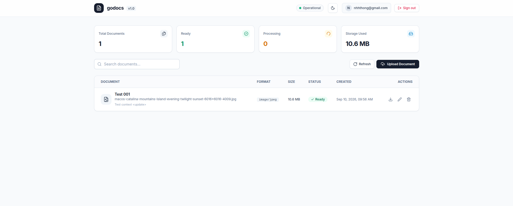
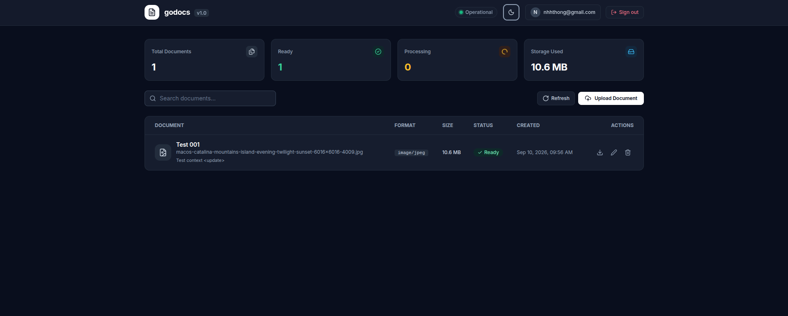
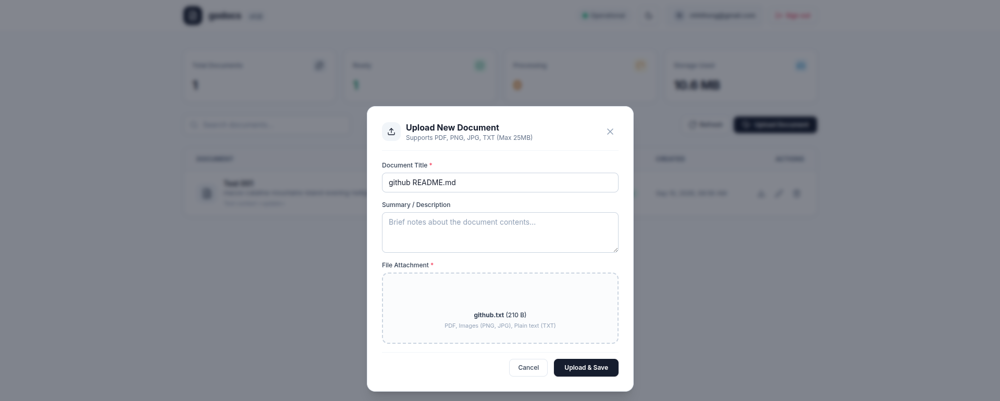
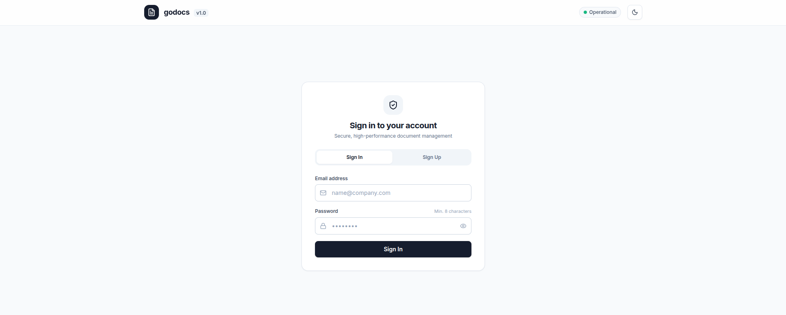
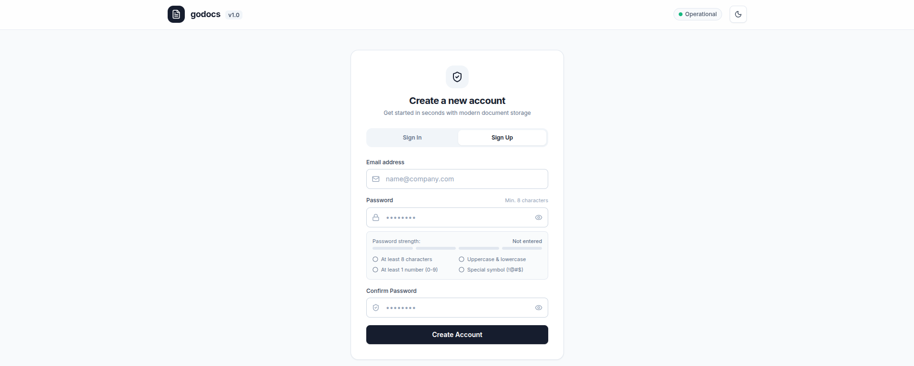
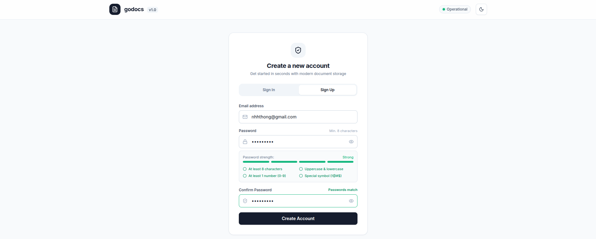
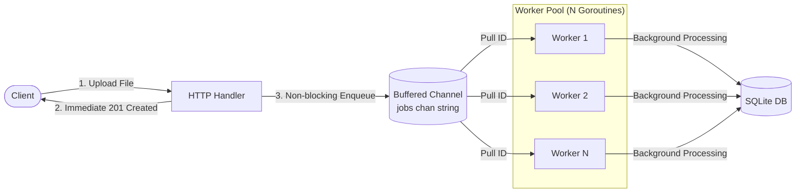
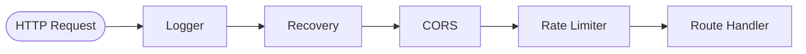

<div align="center">
  
  <h1>godocs</h1>

  <p>A simple, runnable Go demo application built to help learners understand goroutines, authentication, CORS, and database access using the standard library.</p>

  <p>
    <a href="https://go.dev/"></a>
    <a href="https://github.com/you/godocs/blob/main/LICENSE"></a>
    <a href="https://sqlite.org/"></a>
    <a href="https://tailwindcss.com/"></a>
  </p>
</div>

<br>

Many Go tutorials show isolated snippets for goroutines or HTTP handlers, but it can be hard to see how those pieces connect in a real project. `godocs` is a compact full-stack document manager created as a learning reference. It uses Go's standard library (`net/http`) alongside a single-file HTML/Tailwind frontend, so you can clone the repository, run one command, and inspect working code right away.

```bash
$ go run ./cmd/api
{"time":"2026-09-10T10:00:00Z","level":"INFO","msg":"listening","addr":":8080"}
```

---

## User Interface Tour

The frontend is a single HTML file (`web/index.html`) using Tailwind CSS and Lucide icons. It communicates with the Go backend over standard JSON and multipart endpoints.

<table width="100%">
  <tr>
    <td width="33%" valign="top">
      <h4 align="center">Light Mode Dashboard</h4>
      <a href="resources/4_demo_homepage.png">
        
      </a>
    </td>
    <td width="33%" valign="top">
      <h4 align="center">Dark Mode Dashboard</h4>
      <a href="resources/5_demo_darktheme.png">
        
      </a>
    </td>
    <td width="33%" valign="top">
      <h4 align="center">Upload Modal</h4>
      <a href="resources/6_demo_upload.png">
        
      </a>
    </td>
  </tr>
  <tr>
    <td width="33%" valign="top">
      <h4 align="center">Sign In</h4>
      <a href="resources/1_demo_signin.png">
        
      </a>
    </td>
    <td width="33%" valign="top">
      <h4 align="center">Sign Up</h4>
      <a href="resources/2_demo_signup.png">
        
      </a>
    </td>
    <td width="33%" valign="top">
      <h4 align="center">Password Strength Meter</h4>
      <a href="resources/3_demo_signup_2.png">
        
      </a>
    </td>
  </tr>
</table>

---

## What You Can Learn from This Codebase

> **Deep Dive**: For an exhaustive architectural breakdown of every API flow, middleware pipeline, and background subsystem with Mermaid sequence diagrams, see the [System Execution Guide](resources/FLOW.md).

If you are learning Go, this project provides practical examples of common backend tasks:

### 1. Goroutines, Channels, and Worker Pools
In [`internal/worker/indexer.go`](internal/worker/indexer.go), document processing is handed off to background goroutines instead of blocking the HTTP response:



- A buffered Go channel (`chan string`) acts as an in-process queue.
- A fixed number of worker goroutines loop over the channel to process incoming IDs.
- Non-blocking enqueue (`select` with `default`) applies backpressure when the queue is full.
- Graceful shutdown closes the channel and uses `sync.WaitGroup` so in-flight tasks finish before the process exits.

### 2. Authentication and Cookies
In [`internal/auth/`](internal/auth/):
- Passwords are hashed using bcrypt (`bcrypt.DefaultCost`) via `golang.org/x/crypto`.
- Successful logins generate a high-entropy (256-bit) session token; only its SHA-256 hash is stored in SQLite, while the raw token is sent back as an `HttpOnly`, `SameSite=Lax` cookie.
- Middleware extracts the cookie on protected endpoints and attaches the authenticated user to the request `context.Context`.
- Failed logins run a dummy hash calculation so attackers cannot measure response time differences to discover registered emails.

### 3. Middleware and CORS
In [`internal/httpx/`](internal/httpx/), incoming requests pass through a composable chain of standard `http.Handler` wrappers:



- Middleware is written as standard functions wrapping `http.Handler` (`func(http.Handler) http.Handler`).
- CORS handling inspects origins, sets appropriate headers, and answers preflight `OPTIONS` requests.
- A token-bucket rate limiter tracks requests per IP to protect sensitive endpoints.
- A panic recovery middleware catches unhandled runtime panics and returns a structured 500 error instead of terminating the server.

### 4. Database Access with Pure Go SQLite
In [`internal/db/`](internal/db/):
- Uses `database/sql` with `modernc.org/sqlite`, a CGO-free driver that compiles cleanly on Linux, macOS, and Windows without external toolchains.
- Schema migrations run automatically on startup from simple `.sql` files in [`migrations/`](migrations/); each file is applied once inside a transaction and recorded in a `schema_migrations` table.
- Configures SQLite write-ahead logging (WAL) and connection limits for safe concurrency.

### 5. Standard Library Routing (Go 1.22+)
In [`cmd/api/main.go`](cmd/api/main.go), routing uses the standard `http.NewServeMux()` with method matching and path variables (`GET /api/documents/{id}`), demonstrating that external web routers are often unnecessary for typical APIs.

---

## Quick Start

### Prerequisites
- **Go 1.22 or higher** ([download here](https://go.dev/dl/))

### Running the App
```bash
# 1. Clone the project
git clone https://github.com/you/godocs.git
cd godocs

# 2. Start the server
go run ./cmd/api
```

Open your browser at **`http://localhost:8080`**. Create a test account, sign in, and upload a few documents to see the background worker and search in action.

### Common Commands
| Command | Purpose |
|---|---|
| `go run ./cmd/api` | Run the application locally |
| `go test ./...` | Run all unit tests |
| `go test -race ./...` | Run unit tests with Go's race detector enabled |
| `make smoke` | Run end-to-end integration tests against a test HTTP server |
| `make test` | Run tests with race detection and coverage reporting |

### Running with Docker (Optional)
If you prefer testing inside a container:
```bash
docker build -t godocs .
docker run -p 8080:8080 -e APP_COOKIE_SECURE=false godocs
```

---

## REST API Summary

Endpoints use JSON for metadata, and multipart forms for file uploads.

### Auth Endpoints
| Method | Path | Auth | Description | Flow Guide |
|---|---|:---:|---|:---:|
| `POST` | `/api/auth/register` | No | Register a new user (`email`, `password`) | [View Flow](resources/flow/auth_register.md) |
| `POST` | `/api/auth/login` | No | Log in and receive a session cookie | [View Flow](resources/flow/auth_login.md) |
| `POST` | `/api/auth/logout` | Cookie | Clear the active session | [View Flow](resources/flow/auth_logout.md) |
| `GET` | `/api/auth/me` | Cookie | Retrieve the current user's profile | [View Flow](resources/flow/auth_me.md) |

### Document Endpoints
| Method | Path | Auth | Description | Flow Guide |
|---|---|:---:|---|:---:|
| `POST` | `/api/documents` | Yes | Upload a document (multipart form with `file`, `title`, `summary`) | [View Flow](resources/flow/document_upload.md) |
| `GET` | `/api/documents` | Yes | List documents with pagination (`?q=&limit=&offset=`) | [View Flow](resources/flow/document_list.md) |
| `GET` | `/api/documents/{id}` | Yes | Get a single document record by ID | [View Flow](resources/flow/document_get.md) |
| `GET` | `/api/documents/{id}/file` | Yes | Download or stream the binary file (supports HTTP range requests) | [View Flow](resources/flow/document_download.md) |
| `PATCH` | `/api/documents/{id}` | Yes | Update document title or summary | [View Flow](resources/flow/document_update.md) |
| `DELETE` | `/api/documents/{id}` | Yes | Delete a document and its stored file | [View Flow](resources/flow/document_delete.md) |

### Health Check
| Method | Path | Description | Flow Guide |
|---|---|---|:---:|
| `GET` | `/healthz` | Checks database ping and reports server health | [View Flow](resources/flow/system_healthz.md) |

---

## Testing

The codebase includes both unit tests and an integration test verifying the full HTTP flow:

```bash
# Run unit tests across all packages:
go test ./...

# Run tests with race detection to verify thread-safety:
go test -race ./...

# Run the end-to-end smoke test suite:
make smoke
```

---

## License

This project is open source and available under the [MIT License](LICENSE).
