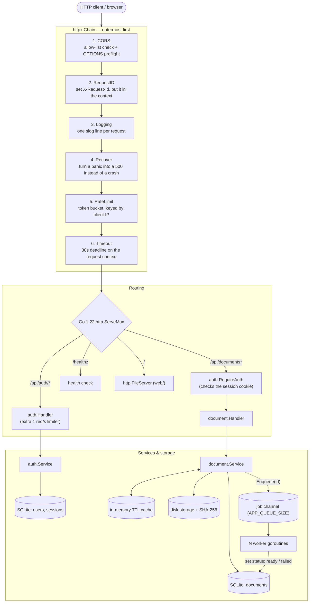
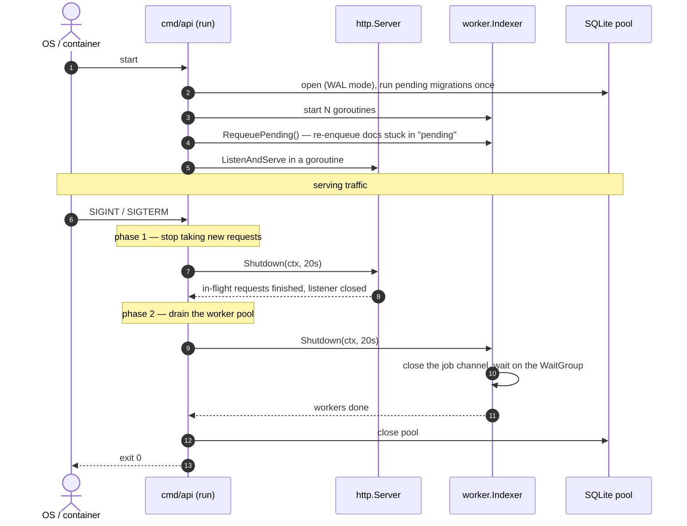

# godocs — Flows & API Directory

This is the index of every request flow and background job in **`godocs`**. Each
endpoint has its own file under [`resources/flow/`](file:///home/vnjdev/projects/godocs/resources/flow/)
with a sequence diagram, the exact error codes it returns, and notes on what the
Go code is doing and why.

New to the codebase? Read this page, then open `flow/document_upload.md` — it
touches almost every part of the system (auth, validation, disk I/O, database,
goroutines).

---

## 1. Flow Catalog

### Authentication (`/api/auth/*`)

| Method & Path | Flow | Rate limit | What it does |
|---|---|:---:|---|
| [`POST /api/auth/register`](flow/auth_register.md) | [Register](flow/auth_register.md) | 1 req/s, burst 5 | Normalise email, hash password with bcrypt, create user |
| [`POST /api/auth/login`](flow/auth_login.md) | [Login](flow/auth_login.md) | 1 req/s, burst 5 | Check password, create a session, set the session cookie |
| [`POST /api/auth/logout`](flow/auth_logout.md) | [Logout](flow/auth_logout.md) | global | Delete the session row, clear the cookie |
| [`GET /api/auth/me`](flow/auth_me.md) | [Current user](flow/auth_me.md) | global | Return the signed-in user's profile |

### Documents (`/api/documents*`)

Every document endpoint sits behind the `auth.RequireAuth` middleware, and every
one only sees documents the caller created (`documents.created_by`). Asking for
someone else's document returns `404`, not `403`, so you can't even tell it exists.

| Method & Path | Flow | Cache effect | What it does |
|---|---|:---:|---|
| [`POST /api/documents`](flow/document_upload.md) | [Upload](flow/document_upload.md) | — | Size limit, MIME sniff, atomic disk write with SHA-256, hand off to a worker |
| [`GET /api/documents`](flow/document_list.md) | [List / search](flow/document_list.md) | — | Escape `LIKE` wildcards, count + page, newest first |
| [`GET /api/documents/{id}`](flow/document_get.md) | [Get one](flow/document_get.md) | read / fill | In-memory cache first, database on a miss |
| [`GET /api/documents/{id}/file`](flow/document_download.md) | [Download](flow/document_download.md) | — | Path-traversal check, `http.ServeContent` (supports `Range`) |
| [`PATCH /api/documents/{id}`](flow/document_update.md) | [Update metadata](flow/document_update.md) | delete | Validate `title`/`summary`, write, drop the cache entry |
| [`DELETE /api/documents/{id}`](flow/document_delete.md) | [Delete](flow/document_delete.md) | delete | Remove the row, the cache entry, and the file |

### System & background

| Subsystem | Flow | Runs | What it does |
|---|---|:---:|---|
| [`GET /healthz`](flow/system_healthz.md) | [Health check](flow/system_healthz.md) | on request | Ping SQLite; `200` if reachable, `503` if not |
| [Worker pool](flow/background_worker.md) | [Async indexing](flow/background_worker.md) | goroutines | Buffered channel + N workers, non-blocking enqueue, drains on shutdown |
| [Janitors](flow/background_janitors.md) | [Sweepers](flow/background_janitors.md) | tickers | Hourly: delete expired sessions. Every minute: drop expired cache entries |

---

## 2. Request pipeline

Every request goes through the same middleware chain (built in
`cmd/api/main.go` with `httpx.Chain`) before it reaches the router. Middleware is
just `func(http.Handler) http.Handler` — a handler that wraps another handler.

---

## 3. Startup and shutdown

`run()` in [`cmd/api/main.go`](file:///home/vnjdev/projects/godocs/cmd/api/main.go)
wires everything by hand — no dependency-injection framework. Reading it top to
bottom is the fastest way to learn the architecture. Shutdown drains HTTP first,
then the workers, so nothing in flight is dropped.

---

## 4. Design choices worth knowing

1. **Domain code doesn't import infrastructure.** `internal/document` and
   `internal/auth` define the interfaces they need (`Repository`, `BlobStore`,
   `Cache`, `Indexer`); `internal/db` and `internal/storage` implement them. The
   dependency arrow points inward, which keeps the domain easy to unit-test with
   small fakes.
2. **Standard library first.** Routing (`http.ServeMux` with method + path
   patterns, Go 1.22), logging (`log/slog`), concurrency (`sync`, `context`) —
   no web framework.
3. **Pure-Go SQLite.** `modernc.org/sqlite` needs no C compiler, so `go build`
   produces one portable binary. The pool is limited to a single connection
   because SQLite has one writer at a time; that removes lock contention at the
   cost of serialising queries (fine for this workload).
4. **Non-blocking background work.** Upload enqueues with `select { case ch <- id:
   default: }`, so a full queue never blocks the HTTP response. Workers run on
   their own `context` with a 30s timeout, independent of the client.
