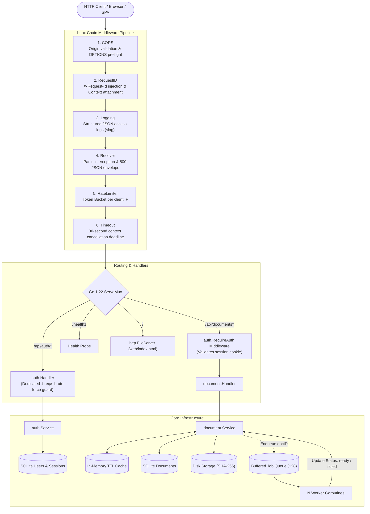
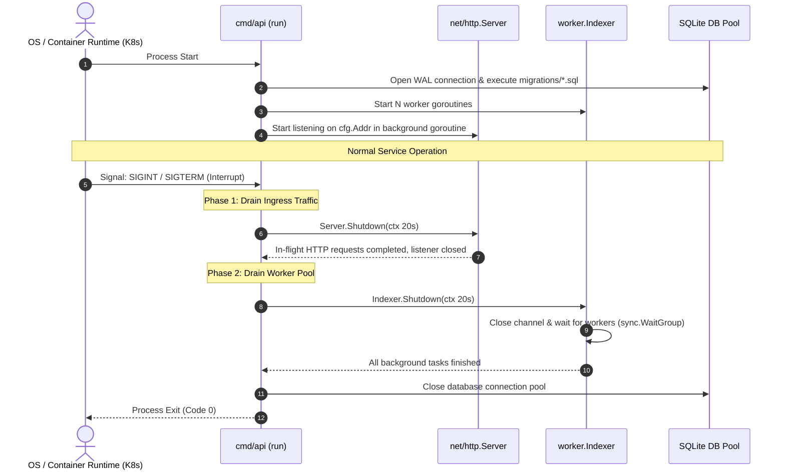

# godocs Architectural Flows & Master API Directory

This document serves as the central architectural reference and master index of all execution flows in **`godocs`**. Each individual API endpoint and background subsystem is decoupled into its own dedicated, in-depth specification document located in [`resources/flow/`](file:///home/vnjdev/projects/godocs/resources/flow/).

---

## 1. Master Flow Catalog

Click any flow below to view its complete step-by-step sequence diagram, error mappings, security mitigations, and storage guarantees.

### 🔒 Authentication & Identity Flows (`/api/auth/*`)
| HTTP Method & Path | Flow Specification | Rate Limit | Description |
|---|---|:---:|---|
| [`POST /api/auth/register`](flow/auth_register.md) | [**User Registration Flow**](flow/auth_register.md) | 1 req/s (burst 5) | Email normalization, bcrypt hashing (cost 12), 128-bit CSPRNG identifier |
| [`POST /api/auth/login`](flow/auth_login.md) | [**User Login & Cookie Dispatch**](flow/auth_login.md) | 1 req/s (burst 5) | Timing-safe credential comparison, cryptographic session creation, `HttpOnly` cookie |
| [`POST /api/auth/logout`](flow/auth_logout.md) | [**User Logout & Session Revocation**](flow/auth_logout.md) | Global | Server-side SQLite session deletion, browser cookie purge (`Max-Age=-1`) |
| [`GET /api/auth/me`](flow/auth_me.md) | [**Current User Profile Verification**](flow/auth_me.md) | Global | Session lookup, expiration verification, caller profile retrieval |

---

### 📄 Document Management Flows (`/api/documents*`)
*All document endpoints are strictly guarded by the `auth.RequireAuth` middleware.*

| HTTP Method & Path | Flow Specification | Cache Action | Description |
|---|---|:---:|---|
| [`POST /api/documents`](flow/document_upload.md) | [**Document Upload & Async Ingestion**](flow/document_upload.md) | Write Initial | `MaxBytesReader` size cap, 512-byte magic byte MIME sniffing, atomic staging disk write with in-flight SHA-256, non-blocking worker queue dispatch |
| [`GET /api/documents`](flow/document_list.md) | [**Document Listing & Paginated Search**](flow/document_list.md) | None | SQL `LIKE` wildcard escaping (`%`, `_`), total count calculation, chronological pagination |
| [`GET /api/documents/{id}`](flow/document_get.md) | [**Document Details (Cache-Aside)**](flow/document_get.md) | Read / Backfill | In-memory concurrent generic TTL cache (`RLock`), SQLite database fallback |
| [`GET /api/documents/{id}/file`](flow/document_download.md) | [**Binary File Download & Range Streaming**](flow/document_download.md) | HTTP ETag | Lexical path traversal protection, RFC 5987 Unicode filename encoding, `http.ServeContent` with HTTP `206 Partial Content` Range seeking |
| [`PATCH /api/documents/{id}`](flow/document_update.md) | [**Document Metadata Update**](flow/document_update.md) | Invalidate (`Delete`) | Input validation, SQLite update, instantaneous cache eviction under write lock |
| [`DELETE /api/documents/{id}`](flow/document_delete.md) | [**Document Deletion & Disk Purge**](flow/document_delete.md) | Invalidate (`Delete`) | Database record deletion, cache eviction, physical blob file removal from disk |

---

### ⚙️ System & Infrastructure Flows
| Target Subsystem | Flow Specification | Lifecycle | Description |
|---|---|:---:|---|
| [`GET /healthz`](flow/system_healthz.md) | [**Health Check & Database Ping**](flow/system_healthz.md) | Continuous | SQLite context ping, liveness/readiness probe (`200 OK` vs `503 Unavailable`) |
| [**Worker Subsystem**](flow/background_worker.md) | [**Async Indexing Worker Pool**](flow/background_worker.md) | Background Pool | Bounded channel FIFO queue (buffer 128), worker goroutines, non-blocking backpressure, graceful shutdown drain |
| [**Janitor Routines**](flow/background_janitors.md) | [**Maintenance Janitors & Sweepers**](flow/background_janitors.md) | Periodic Tickers | Hourly SQLite expired session purge and 1-minute in-memory RAM cache eviction |

---

## 2. High-Level System Topology & Ingress Pipeline

Every request enters through `cmd/api/main.go` and is processed through a strict, zero-allocation middleware pipeline before reaching the Go 1.22+ `http.ServeMux` router:

---

## 3. Global Service Bootstrap & Two-Phase Graceful Shutdown

The service startup and termination sequence in [`cmd/api/main.go`](file:///home/vnjdev/projects/godocs/cmd/api/main.go) ensures zero dropped requests and no orphaned background workers:

---

## 4. Architectural Decisions & Production Design Patterns

1. **Clean Hexagonal Architecture**: Domain logic in `internal/document` and `internal/auth` never imports infrastructure drivers (`internal/storage` or `internal/db`). All boundaries are decoupled via consumer-defined Go interfaces (`Repository`, `BlobStore`, `Cache`, `Indexer`).
2. **Standard Library First**: Built strictly with Go 1.22+ standard library features (`net/http` routing with method matching and path parameters, `log/slog` structured logging, `sync`, `context`) without heavy external web frameworks.
3. **Pure Go CGO-Free SQLite**: Powered by `modernc.org/sqlite` in Write-Ahead Logging (`WAL`) mode, allowing single-binary portable builds without requiring a C compiler.
4. **Resilient Non-Blocking Concurrency**: Channel submission employs `select` with `default` for instant backpressure, and workers utilize independent execution contexts so client aborts do not corrupt background indexing.
