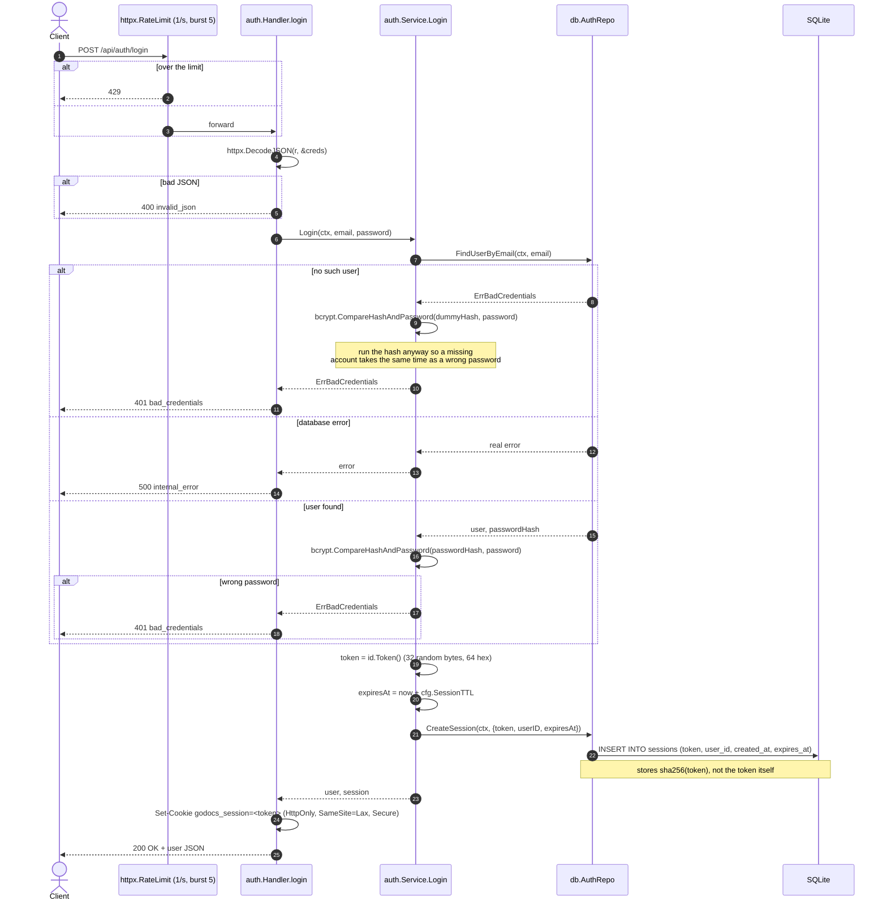

[← Back to the flow index](../FLOW.md)

# Flow: Login (`POST /api/auth/login`)

Checks an email + password, creates a session row, and sends back the session
cookie. Public endpoint.

---

## 1. Contract

- **Method & path**: `POST /api/auth/login`
- **Auth**: none
- **Rate limit**: 1 req/s, burst 5, per IP
- **Request / response**: JSON; on success also sets the `godocs_session` cookie

### Request

```json
{
  "email": "learner@example.com",
  "password": "correcthorsebattery"
}
```

### Response — `200 OK`

```http
HTTP/1.1 200 OK
Content-Type: application/json
Set-Cookie: godocs_session=<64-hex-token>; Path=/; Max-Age=604800; HttpOnly; SameSite=Lax; Secure

{
  "id": "3f9a2b7c1d8e4f0a6b5c9d2e7f1a0b3c",
  "email": "learner@example.com",
  "created_at": "2026-09-10T10:00:00Z"
}
```

---

## 2. Sequence



---

## 3. Step by step

1. **Rate limit** — same per-IP bucket as register, to slow down password
   guessing.
2. **Look up the user.** `FindUserByEmail` returns `ErrBadCredentials` when there
   is no row, and a wrapped error for a real database problem. The service tells
   the two apart: a missing user → `401 bad_credentials`, a database failure →
   `500`. (An earlier version turned *every* error into `401`, which hid outages.)
3. **Even out the timing.** If the user doesn't exist, the service still runs one
   bcrypt comparison against a fixed dummy hash. Without this, "no such account"
   would return noticeably faster than "wrong password", which leaks which emails
   are registered.
4. **Check the password** with `bcrypt.CompareHashAndPassword`. It re-hashes the
   input with the salt embedded in the stored hash and compares — you never
   decrypt a bcrypt hash.
5. **Create the session.** `id.Token()` reads 32 bytes from `crypto/rand` and
   hex-encodes them (64 chars). The row expires after `APP_SESSION_TTL_HOURS`
   (default 168 = 7 days).
6. **Store only a hash.** The database keeps `sha256(token)`. The real token
   lives only in the user's cookie, so a leaked `sessions` table can't be used to
   impersonate anyone. Plain SHA-256 is fine here because the token is already
   256 bits of randomness — no slow hash needed.
7. **Set the cookie.**
   - `HttpOnly` — JavaScript can't read it, which limits XSS damage.
   - `SameSite=Lax` — the browser won't send it on cross-site POSTs, blocking basic CSRF.
   - `Secure` — HTTPS only (set `APP_COOKIE_SECURE=false` for plain-HTTP local dev).

---

## 4. Errors

| Condition | Status | Code |
|---|:---:|---|
| Over the rate limit | `429` | `rate_limited` |
| Bad JSON body | `400` | `invalid_json` |
| Unknown email | `401` | `bad_credentials` |
| Wrong password | `401` | `bad_credentials` |
| Database failure | `500` | `internal_error` |
