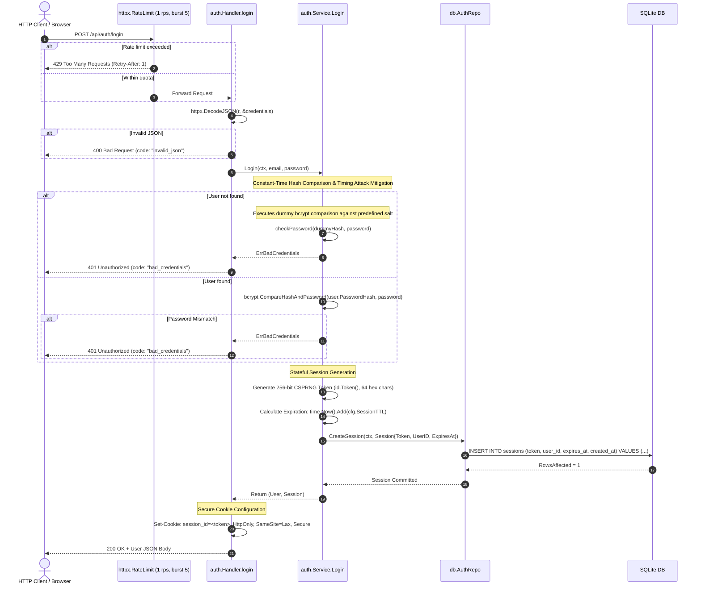

[← Back to Master Flow Catalog](../FLOW.md)

# Flow: User Login (`POST /api/auth/login`)

This document outlines the complete technical execution flow for user authentication and session establishment in **`godocs`**.

---

## 1. Overview & Endpoint Contract

- **HTTP Method & Path**: `POST /api/auth/login`
- **Authentication Required**: No (Public Endpoint)
- **Rate Limit**: Strictly limited to `1 req/s` (burst `5`) per client IP via `httpx.RateLimit(1, 5)`.
- **Request Content-Type**: `application/json`
- **Response**: Returns User JSON profile and sets an `HttpOnly` stateful session cookie.

### Request Payload
```json
{
  "email": "learner@example.com",
  "password": "CorrectHorseBattery99!"
}
```

### Response Headers & Body (`200 OK`)
```http
HTTP/1.1 200 OK
Content-Type: application/json
Set-Cookie: session_id=0191c49b-73a2-71c1-90a8-a5b8b6e680a1; Path=/; Expires=Thu, 17 Sep 2026 10:00:00 GMT; Max-Age=604800; HttpOnly; SameSite=Lax

{
  "id": "0191c49b-73a2-71c1-90a8-a5b8b6e680a1",
  "email": "learner@example.com",
  "created_at": "2026-09-10T10:00:00Z"
}
```

---

## 2. Sequence Diagram



---

## 3. Step-by-Step Processing Pipeline

1. **Brute-Force Guard**:
   Dedicated per-IP rate limiter throttles incoming attempts to protect against online credential stuffing.
2. **Timing-Safe Error Uniformity & Dummy Hash Defense**:
   If the email does not exist, the service executes a dummy bcrypt comparison (`checkPassword(string(dummyHash), password)`) against a predefined constant salt before returning `ErrBadCredentials`. This guarantees authentication requests take identical CPU time regardless of whether the account exists, completely neutralizing timing side-channel attacks for account enumeration.
3. **Password Verification**:
   Calls `bcrypt.CompareHashAndPassword`, safely comparing plaintext input against the salted bcrypt hash.
4. **High-Entropy Session Token Issuance**:
   A 256-bit cryptographically secure pseudorandom token (64-character hex string) is generated via `id.Token()` reading directly from the OS CSPRNG (`crypto/rand`).
5. **Database Storage**:
   The session record is committed to SQLite with a 7-day expiration (`APP_SESSION_TTL_HOURS=168`).
6. **Cookie Security Hardening**:
   - `HttpOnly`: Prevents JavaScript execution from accessing the cookie (`document.cookie`), mitigating XSS session theft.
   - `SameSite=Lax`: Defends against CSRF attacks across external sites.
   - `Secure`: Ensures cookies are transmitted only over TLS/HTTPS (configurable for localhost dev).
   - `Path=/`: Valid across all application endpoints.

---

## 4. Error Mapping Reference

| Condition | HTTP Status | Error Code | Description |
|---|:---:|---|---|
| Rate limit exceeded | `429` | `rate_limit_exceeded` | Token bucket depleted |
| Malformed JSON body | `400` | `invalid_json` | Syntax error in JSON body |
| Email not found | `401` | `bad_credentials` | Uniform error message |
| Incorrect password | `401` | `bad_credentials` | Uniform error message |
| Database failure | `500` | `internal_error` | System failure |
