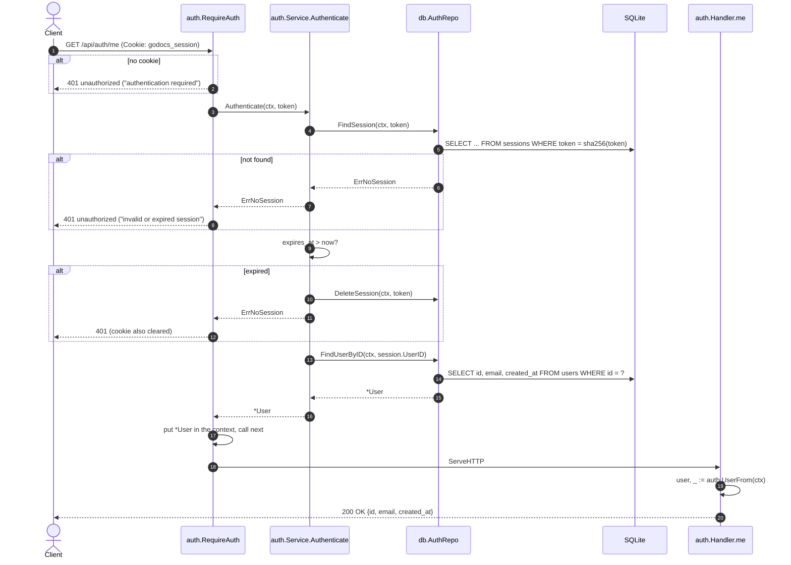

[← Back to the flow index](../FLOW.md)

# Flow: Current user (`GET /api/auth/me`)

Returns the profile of whoever is signed in. The frontend calls it on page load
to decide whether to show the login form or the dashboard.

---

## 1. Contract

- **Method & path**: `GET /api/auth/me`
- **Auth**: required — `godocs_session` cookie
- **Response**: JSON

```json
{
  "id": "3f9a2b7c1d8e4f0a6b5c9d2e7f1a0b3c",
  "email": "learner@example.com",
  "created_at": "2026-09-10T10:00:00Z"
}
```

---

## 2. Sequence

`/me` is wrapped in the same `auth.RequireAuth` middleware the document routes
use, so by the time `handler.me` runs, the session is already validated and the
`*User` is in the request context. The handler just reads it out.



---

## 3. Step by step

1. **`RequireAuth` reads the cookie.** No cookie → `401` right away.
2. **Find the session** by `sha256(token)`. No row → `401` and the cookie is
   cleared. A *database* error here is different: `RequireAuth` returns `500` and
   leaves the cookie alone, so a brief outage doesn't sign everyone out.
3. **Check expiry.** If `expires_at` is in the past, delete the stale row, clear
   the client's cookie, and return `401`.
4. **Load the user** with `FindUserByID`. (If the user was deleted but a session
   row lingered, this also returns `401`.)
5. **Middleware stores the `*User`** in the context with `context.WithValue` and
   calls the next handler.
6. **`handler.me`** pulls it back out with `auth.UserFrom(ctx)` and serialises it.
   No cookie parsing in the handler — that logic lives in one place.
