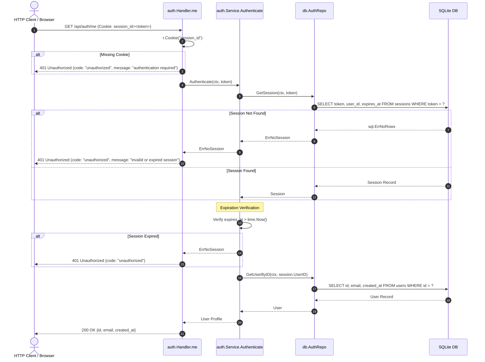

[← Back to Master Flow Catalog](../FLOW.md)

# Flow: Current User Profile (`GET /api/auth/me`)

This document describes how the current authenticated user identity is verified and retrieved in **`godocs`**.

---

## 1. Overview & Endpoint Contract

- **HTTP Method & Path**: `GET /api/auth/me`
- **Authentication Required**: Yes (`session_id` cookie)
- **Response Content-Type**: `application/json`

### Response Body (`200 OK`)
```json
{
  "id": "0191c49b-73a2-71c1-90a8-a5b8b6e680a1",
  "email": "learner@example.com",
  "created_at": "2026-09-10T10:00:00Z"
}
```

---

## 2. Sequence Diagram



---

## 3. Step-by-Step Processing Pipeline

1. **Cookie Extraction**:
   Reads `session_id` from the HTTP request headers. If absent, immediately returns `401 Unauthorized`.
2. **Session Lookup**:
   Queries SQLite `sessions` table for the matching token string.
3. **Validity Check**:
   Compares `expires_at` against the current UTC timestamp `time.Now()`. Expired sessions return `401`.
4. **User Profile Retrieval**:
   Executes `GetUserByID` to load the current profile fields (`id`, `email`, `created_at`).
5. **Response Serialization**:
   Returns the user domain entity formatted as JSON.
