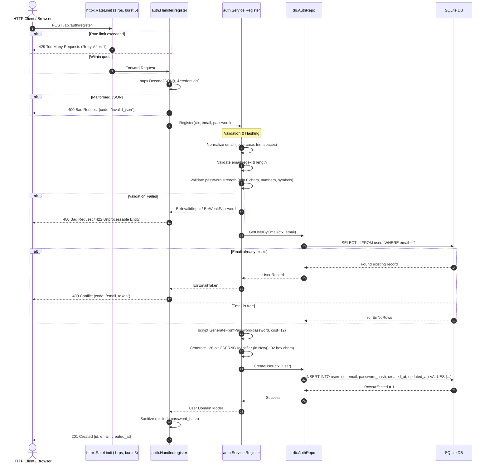

[← Back to Master Flow Catalog](../FLOW.md)

# Flow: User Registration (`POST /api/auth/register`)

This document outlines the complete technical execution flow for registering a new user account in **`godocs`**.

---

## 1. Overview & Endpoint Contract

- **HTTP Method & Path**: `POST /api/auth/register`
- **Authentication Required**: No (Public Endpoint)
- **Rate Limit**: Strictly limited to `1 req/s` (burst `5`) per client IP via `httpx.RateLimit(1, 5)` atop global rate limits.
- **Request Content-Type**: `application/json`
- **Response Content-Type**: `application/json`

### Request Payload
```json
{
  "email": "learner@example.com",
  "password": "CorrectHorseBattery99!"
}
```

### Response Payload (`201 Created`)
```json
{
  "id": "0191c49b-73a2-71c1-90a8-a5b8b6e680a1",
  "email": "learner@example.com",
  "created_at": "2026-09-10T10:00:00Z"
}
```

---

## 2. Sequence Diagram



---

## 3. Step-by-Step Processing Pipeline

1. **Rate Limiting Guard**:
   The dedicated rate limiter verifies that the requesting IP has available token budget in the dedicated bucket (replenishment: 1 req/s, capacity: 5). If exhausted, returns `429 Too Many Requests`.
2. **JSON Decoding**:
   [`httpx.DecodeJSON`](file:///home/vnjdev/projects/godocs/internal/httpx/httpx.go) decodes the JSON body with `DisallowUnknownFields()` and limits payload size to 1MB to prevent memory exhaustion attacks.
3. **Domain Validation**:
   - Email is lowercased and stripped of leading/trailing whitespace.
   - Password must contain $\ge 8$ characters, at least one uppercase letter, one lowercase letter, one digit, and one symbol.
4. **Collision Check**:
   Queries SQLite for any existing user with the same email. If present, returns `409 Conflict` (`email_taken`).
5. **Cryptographic Password Hashing**:
   Uses `golang.org/x/crypto/bcrypt` with work factor `cost = 12`, making brute-force dictionary attacks computationally infeasible.
6. **Persistence**:
   Generates a 128-bit cryptographically secure pseudorandom identifier (32-character hex string) via `id.New()` and commits the record to SQLite.
7. **Response Serialization**:
   Returns the public user metadata (`id`, `email`, `created_at`). The password hash is never serialized to JSON.

---

## 4. Error Mapping Reference

| Condition | HTTP Status | Error Code | Description |
|---|:---:|---|---|
| Rate quota exhausted | `429` | `rate_limit_exceeded` | Token bucket depleted |
| Request body is not valid JSON | `400` | `invalid_json` | Syntax error in JSON |
| Missing email or password | `400` | `invalid_input` | Field validation failed |
| Email already registered | `409` | `email_taken` | Duplicate email constraint |
| Password fails complexity rules | `422` | `weak_password` | Insufficient complexity |
| Database connection error | `500` | `internal_error` | System failure |
