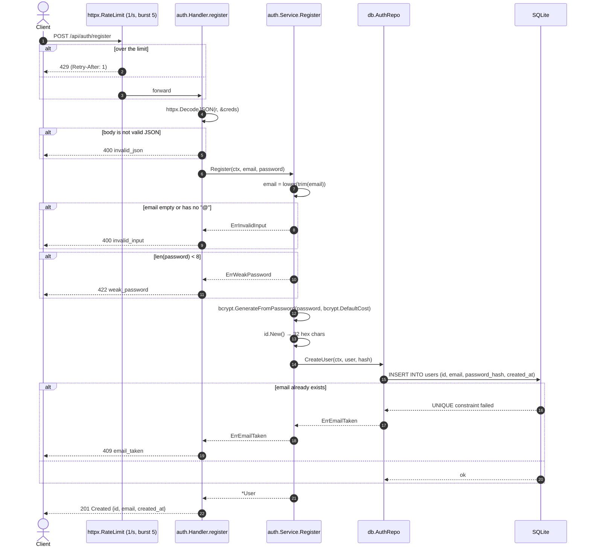

[← Back to the flow index](../FLOW.md)

# Flow: Register (`POST /api/auth/register`)

Creates a new user account. Public endpoint — no cookie required.

---

## 1. Contract

- **Method & path**: `POST /api/auth/register`
- **Auth**: none
- **Rate limit**: 1 req/s, burst 5, per IP (`httpx.RateLimit(1, 5)`), on top of the global limiter
- **Request / response**: JSON

### Request

```json
{
  "email": "learner@example.com",
  "password": "correcthorsebattery"
}
```

### Response — `201 Created`

```json
{
  "id": "3f9a2b7c1d8e4f0a6b5c9d2e7f1a0b3c",
  "email": "learner@example.com",
  "created_at": "2026-09-10T10:00:00Z"
}
```

`id` is 16 random bytes as hex (`id.New()`). The password hash is never returned —
the `User` struct simply has no exported field for it.

---

## 2. Sequence



---

## 3. Step by step

1. **Rate limit.** Each IP gets a token bucket that refills at 1/s up to 5. Empty
   bucket → `429`.
2. **Decode JSON.** `httpx.DecodeJSON` reads at most 1 MB and rejects unknown
   fields (`DisallowUnknownFields`), so a typo in a field name fails loudly.
3. **Validate.** Email is lower-cased and trimmed, then must be non-empty and
   contain `@`. Password must be at least 8 characters — that's the only rule the
   server enforces. (The sign-up form shows a strength meter, but it's advice, not
   a gate.)
4. **No pre-check for duplicates.** The code goes straight to `INSERT` and lets
   the `UNIQUE` constraint on `users.email` do the work. `db.AuthRepo` recognises
   the SQLite constraint error (via `errors.As` on `*sqlite.Error`, with a string
   check as a fallback) and turns it into `ErrEmailTaken`. One round-trip instead
   of two, and no race between the check and the insert.
5. **Hash the password.** `bcrypt.GenerateFromPassword` with `bcrypt.DefaultCost`
   (10). bcrypt generates its own salt and stores it inside the hash string, so
   there is nothing extra to keep.
6. **Insert** the row with a fresh `id.New()`.
7. **Respond.** Return `id`, `email`, `created_at`. Registration does not log the
   user in — the client calls `/api/auth/login` next.

---

## 4. Errors

| Condition | Status | Code |
|---|:---:|---|
| Over the rate limit | `429` | `rate_limited` |
| Body is not valid JSON | `400` | `invalid_json` |
| Email empty or missing `@` | `400` | `invalid_input` |
| Email already registered | `409` | `email_taken` |
| Password shorter than 8 characters | `422` | `weak_password` |
| Database failure | `500` | `internal_error` |
