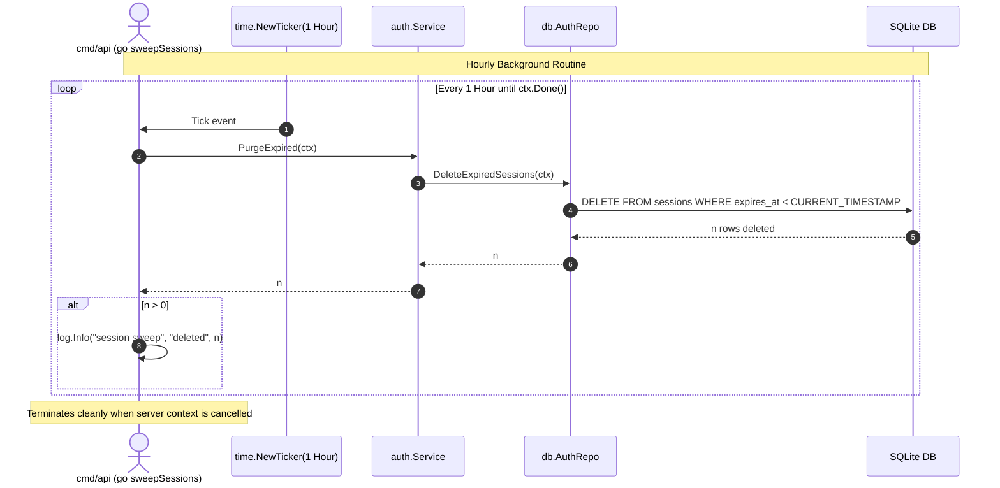
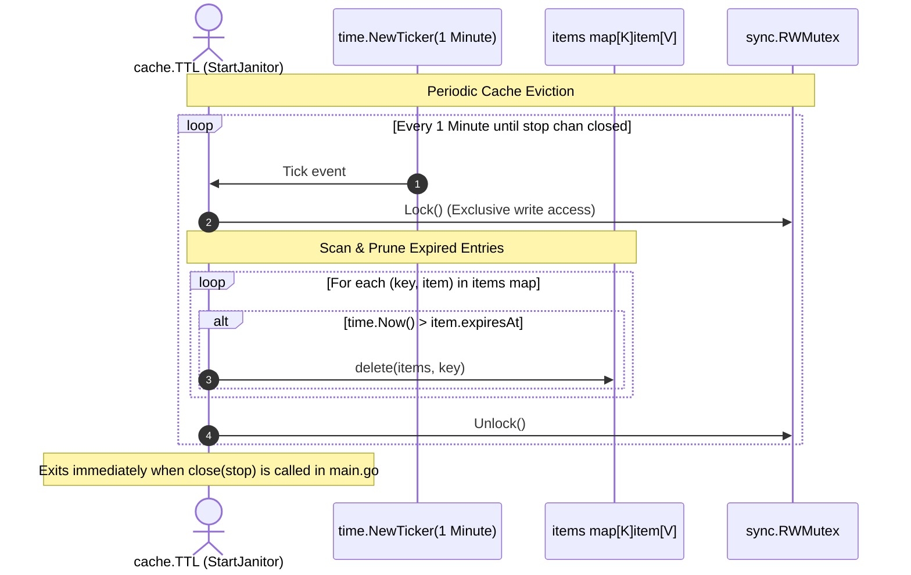

[← Back to Master Flow Catalog](../FLOW.md)

# Flow: Background Maintenance Janitors & Sweepers

This document details the periodic background janitor goroutines responsible for automated data cleanup and RAM management in **`godocs`**.

---

## 1. Subsystems Overview

Long-running Go applications must actively manage in-memory structures and storage tables to prevent memory leaks and database bloat:

1. **Session Sweeper** ([`cmd/api/main.go`](file:///home/vnjdev/projects/godocs/cmd/api/main.go) / [`internal/auth`](file:///home/vnjdev/projects/godocs/internal/auth)): Periodic goroutine purging expired login sessions from SQLite.
2. **Cache Janitor** ([`internal/cache/ttl.go`](file:///home/vnjdev/projects/godocs/internal/cache/ttl.go)): Background routine pruning expired items from the in-memory generic cache.

---

## 2. Session Sweeper Lifecycle

---

## 3. Cache Janitor Lifecycle

---

## 4. Key Guarantees

- **No Goroutine Leaks**: Both routines listen to termination signals (`<-ctx.Done()` or `<-stop`) and stop their respective `time.Ticker` instances with `defer t.Stop()`.
- **Bounded Write Lock Duration**: The cache janitor executes a simple dictionary sweep in memory, releasing the `RWMutex` in sub-millisecond time to ensure minimal reader latency.
- **Resource Reclaim**: Dead sessions are deleted from SQLite, enabling SQLite's auto-vacuum or page reuse to keep database file sizes compact.
