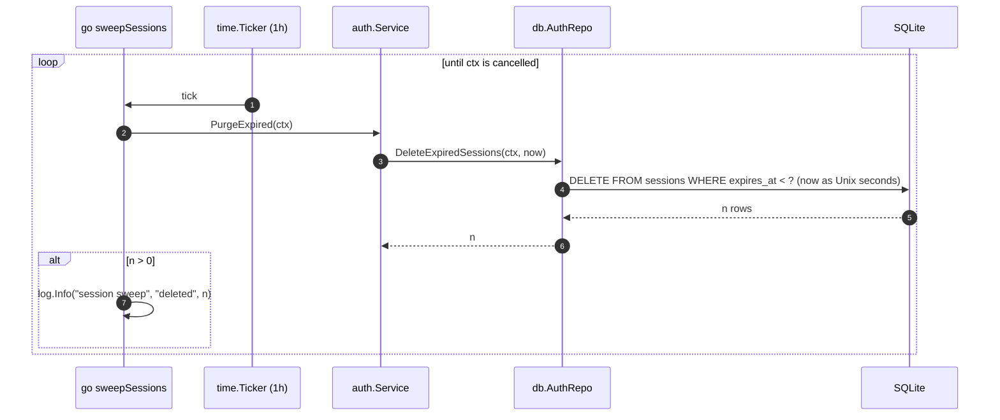
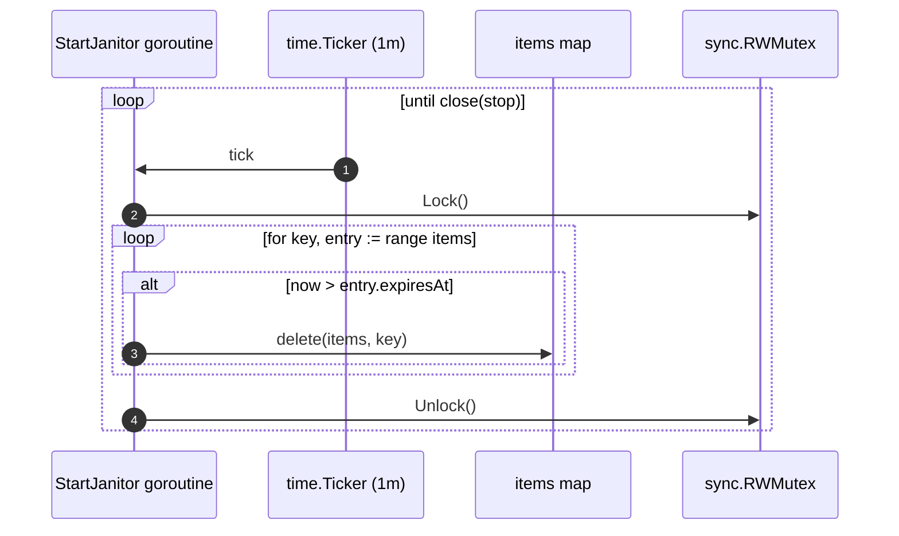

[← Back to the flow index](../FLOW.md)

# Flow: Background janitors

Two small goroutines that run on a `time.Ticker` and clean up as the process
runs. Both stop cleanly when the server shuts down.

1. **Session sweeper** — deletes expired session rows from SQLite, hourly.
   Started in [`cmd/api/main.go`](file:///home/vnjdev/projects/godocs/cmd/api/main.go)
   (`go sweepSessions(...)`).
2. **Cache janitor** — removes expired entries from the in-memory cache, every
   minute. Started by [`cache.TTL.StartJanitor`](file:///home/vnjdev/projects/godocs/internal/cache/ttl.go).

> The startup task `Service.RequeuePending` (re-enqueue documents stuck in
> `pending`) is a related idea but not a janitor — it runs once at boot, not on a
> timer. See the [worker flow](background_worker.md).

---

## 1. Session sweeper

Expiry is also checked on every `/me` and every protected request (see
[auth_me](auth_me.md)) — an expired session is rejected and its row deleted right
then. The sweeper is just housekeeping so dead rows don't accumulate between
logins.

---

## 2. Cache janitor

`cache.TTL.Get` already treats an expired entry as a miss, so the janitor doesn't
affect correctness — it just frees memory that expired keys would otherwise hold
until the next `Get` or `Set` on the same key.

---

## 3. Guarantees

- **No goroutine leaks.** Each loop selects on `<-ctx.Done()` (sweeper) or
  `<-stop` (janitor) and calls `defer ticker.Stop()`.
- **Short lock hold.** The cache janitor does one in-memory map scan per minute
  and releases the write lock immediately, so readers barely notice.
