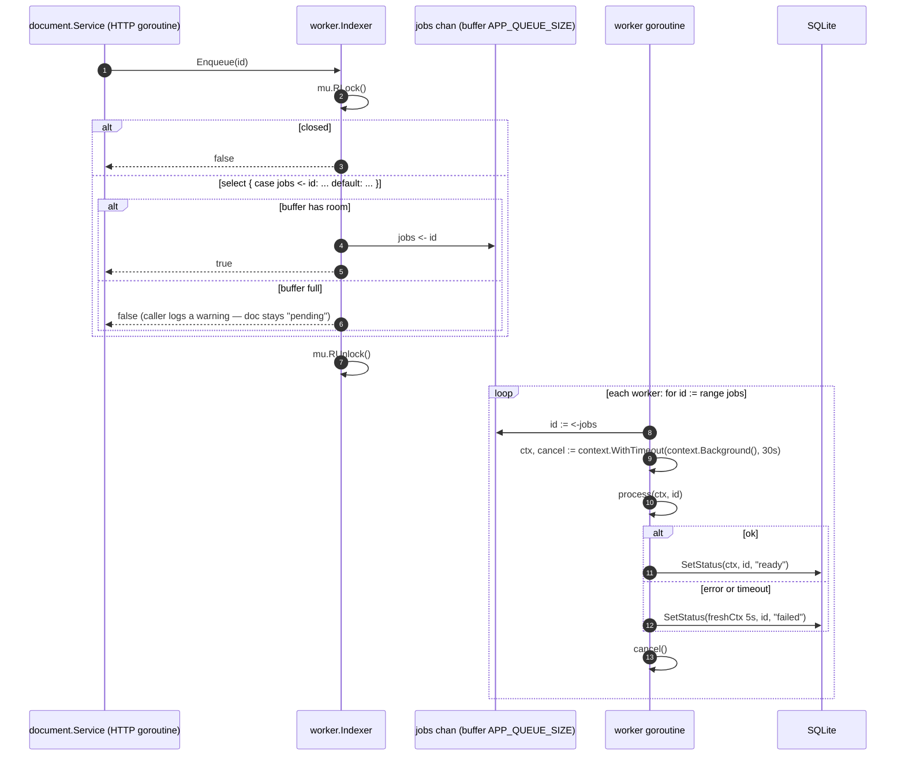
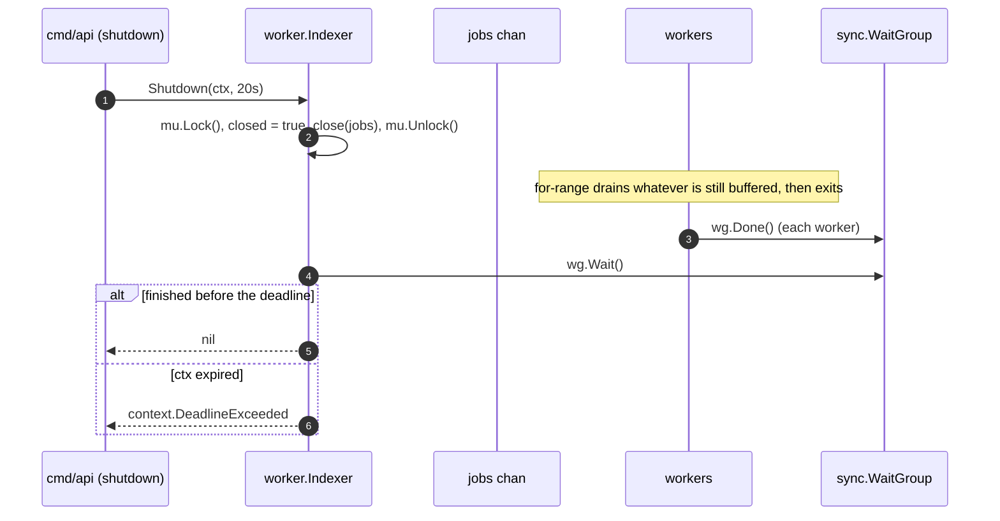

[← Back to the flow index](../FLOW.md)

# Flow: Background indexing worker pool

Source: [`internal/worker/indexer.go`](file:///home/vnjdev/projects/godocs/internal/worker/indexer.go).

Slow per-document work (text extraction, thumbnails, virus scan — here just a
simulated 200 ms sleep) runs on background goroutines so the upload response
doesn't wait for it. This is the classic **buffered channel + worker pool**
pattern.

---

## 1. Pieces

- **Job queue**: `jobs chan string` — a buffered channel of document ids. Buffer
  size is `APP_QUEUE_SIZE` (default 128).
- **Workers**: `N` goroutines (`APP_WORKERS`, default 4), each doing
  `for id := range jobs { ... }`.
- **`sync.WaitGroup`**: lets `Shutdown` wait until every worker has returned.
- **`sync.RWMutex` + `closed bool`**: `Enqueue` takes `RLock`, `Shutdown` takes
  `Lock`. This stops a send from racing `close(jobs)` — sending on a closed
  channel panics, and the race detector flags a concurrent send/close even
  without a panic.

---

## 2. Enqueue and process

`SetStatus` runs a single `UPDATE documents SET status=?, updated_at=? WHERE
id=?` — no read-modify-write — so it can't clobber a `PATCH` that changed the
title at the same time.

The `"failed"` write uses a **new** short context, not `ctx`. `process` usually
fails *because* `ctx` hit its deadline; reusing that already-expired context for
the status write would fail too and leave the document stuck at `"pending"`.

**Recovering stuck documents:** when `Enqueue` returns `false` (full queue) or
the process dies before a worker runs, a document is left at `status = "pending"`.
`Service.RequeuePending` runs once at startup, lists everything still `pending`,
and enqueues it again.

---

## 3. Graceful shutdown

Closing a channel is the idiomatic "no more values" signal: a `for range` over it
processes the remaining buffered items and then ends the loop. `Shutdown` is safe
to call twice (`closed` guard) and from multiple goroutines.

---

## 4. Why it's built this way

1. **Non-blocking enqueue.** `select` with a `default` case means a full queue
   returns `false` instead of blocking the HTTP goroutine. Losing a job is
   acceptable (startup re-queues it); stalling a user's request is not.
2. **Workers own their context.** Each job gets a fresh
   `context.WithTimeout(context.Background(), 30s)`, not the request's context —
   so the work finishes even if the client disconnected right after upload.
3. **`cancel()` every iteration, no `defer`.** `defer` in a `for` that runs for
   the life of the process would pile up until the loop ends. Calling `cancel()`
   at the end of each iteration frees the timer immediately.
