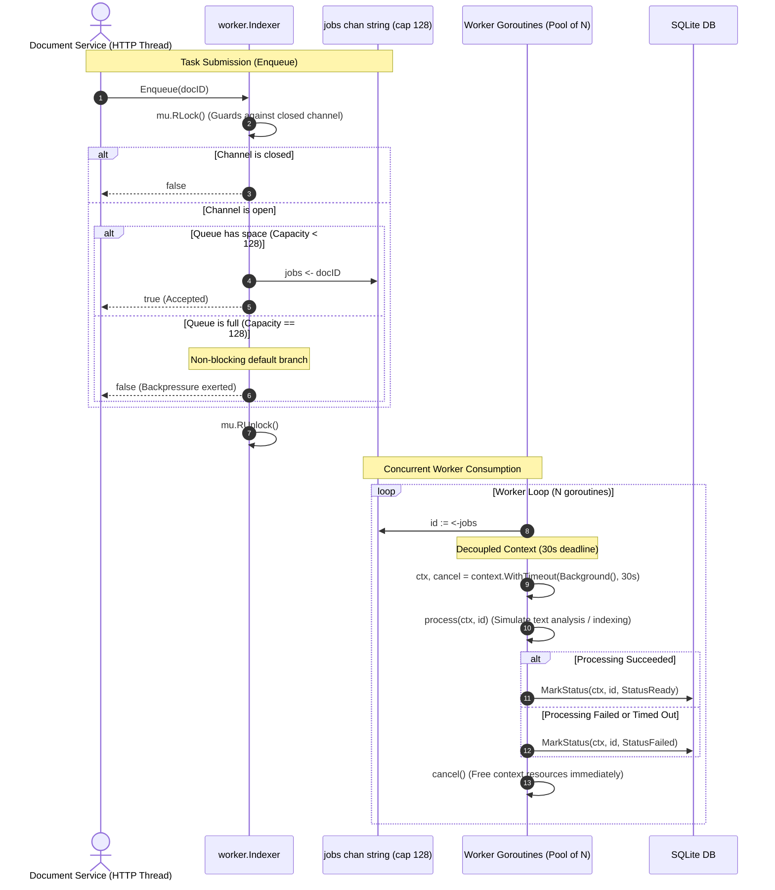
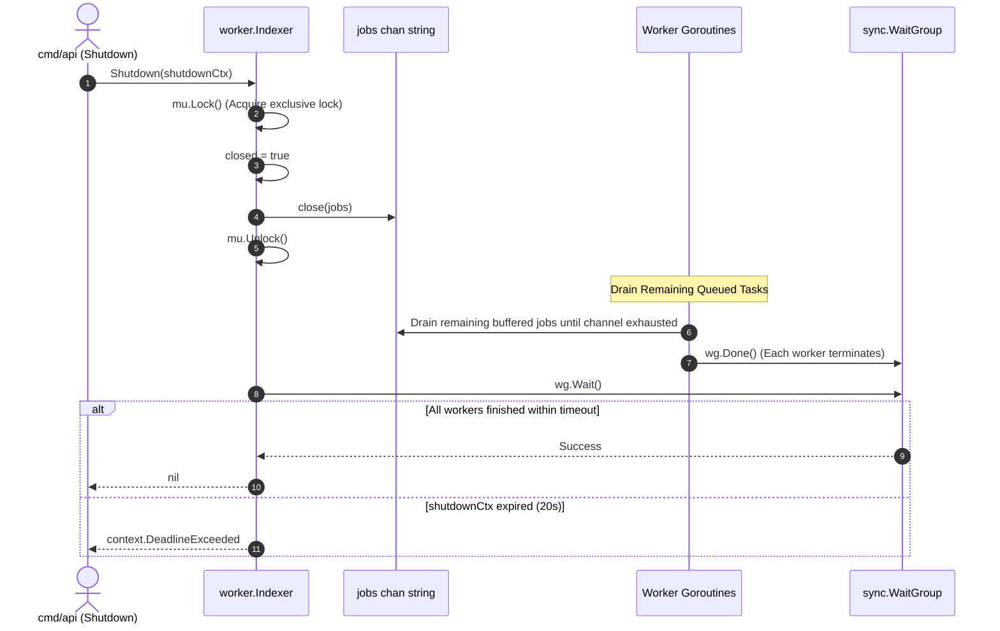

[← Back to Master Flow Catalog](../FLOW.md)

# Flow: Asynchronous Document Indexing Worker Pool

This document details the concurrent background worker pool subsystem in **`godocs`** implemented in [`internal/worker/indexer.go`](file:///home/vnjdev/projects/godocs/internal/worker/indexer.go).

---

## 1. Subsystem Architecture

The background indexing pipeline allows time-consuming document processing (text extraction, summary analysis, thumbnail generation) to occur asynchronously without stalling the HTTP upload response.

### Concurrency Primitives & Synchronization
- **Bounded FIFO Queue**: `jobs chan string` with capacity `128`.
- **Worker Goroutines**: $N$ concurrent workers configured via `APP_WORKERS` (default: 4).
- **Graceful Drain Coordination**: `sync.WaitGroup` monitors active workers.
- **Race Guard for Shutdown**: `sync.RWMutex` serializes task submission against channel closure to prevent runtime panics (`send on closed channel`).

---

## 2. Sequence Diagram

---

## 3. Graceful Worker Pool Termination

During service shutdown (`SIGINT`/`SIGTERM`), the worker pool guarantees that in-progress tasks finish completely without abrupt termination:

---

## 4. Key Invariants & Design Principles

1. **Non-Blocking Backpressure**:
   The `select` with `default` construct prevents the HTTP request thread from hanging when background workers are overwhelmed.
2. **Independent Execution Context**:
   Workers create an independent `context.WithTimeout(context.Background(), 30*time.Second)`. If the originating HTTP client disconnects or aborts, the background worker continues to completion unhindered.
3. **No Panic on Closed Channel**:
   The `RWMutex` allows multiple concurrent `Enqueue()` calls (read lock) while reserving exclusive write access for `Shutdown()` (write lock), preventing data races.
