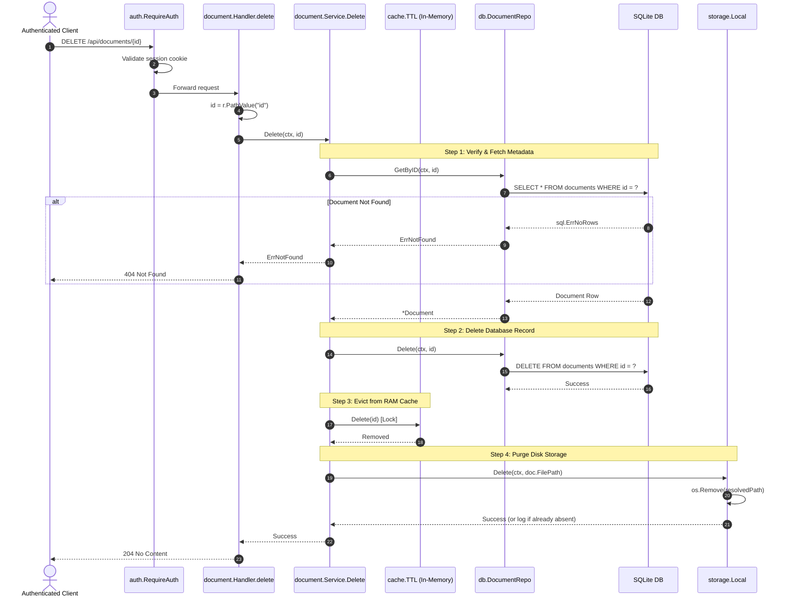

[← Back to Master Flow Catalog](../FLOW.md)

# Flow: Document Deletion (`DELETE /api/documents/{id}`)

This document details the multi-resource cleanup and deletion flow in **`godocs`**.

---

## 1. Overview & Endpoint Contract

- **HTTP Method & Path**: `DELETE /api/documents/{id}`
- **Authentication Required**: Yes (`session_id` cookie via `auth.RequireAuth`)
- **Side Effects**:
  1. Deletes SQLite document metadata record.
  2. Evicts cached entry from in-memory TTL cache.
  3. Deletes binary file from the host filesystem.
- **Response**: `204 No Content`

### Request Example
```http
DELETE /api/documents/0191c49b-89ef-73a2-97b1-b92e316a1b22 HTTP/1.1
Cookie: session_id=0191c49b-73a2-71c1-90a8-a5b8b6e680a1
```

### Response Headers (`204 No Content`)
```http
HTTP/1.1 204 No Content
```

---

## 2. Sequence Diagram



---

## 3. Step-by-Step Processing Pipeline

1. **Entity Verification**:
   Loads the document from the database to obtain its `FilePath`. If it does not exist, immediately halts with `404 Not Found`.
2. **Database Deletion**:
   Executes `DELETE FROM documents WHERE id = ?`.
3. **Cache Eviction**:
   Calls `cache.Delete(id)` under exclusive lock to guarantee subsequent requests do not serve stale data.
4. **Filesystem Purge**:
   Calls `storage.Local.Delete(ctx, doc.FilePath)`, which removes the file from disk using `os.Remove`. If the file was already deleted or missing, the error is handled gracefully without failing the HTTP response.
5. **No-Content Response**:
   Returns HTTP `204 No Content`.
