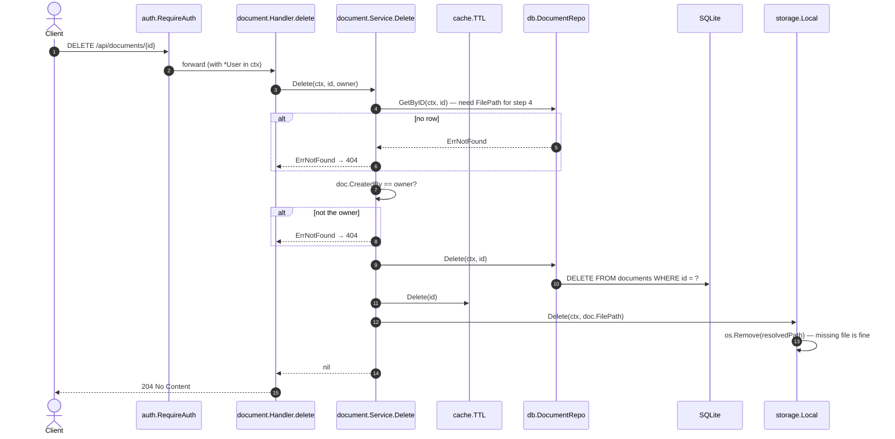

[← Back to the flow index](../FLOW.md)

# Flow: Delete a document (`DELETE /api/documents/{id}`)

Removes a document you own: the database row, the cache entry, and the file on
disk.

---

## 1. Contract

- **Method & path**: `DELETE /api/documents/{id}`
- **Auth**: required (`godocs_session` cookie)
- **Response**: `204 No Content`
- **Effects**: delete the `documents` row → drop the cache entry → delete the file

```http
DELETE /api/documents/9f1c0b7a5e2d4c8b6a3f1e0d9c8b7a6f HTTP/1.1
Cookie: godocs_session=<token>
```

---

## 2. Sequence



---

## 3. Step by step

1. **Load first.** The service needs `FilePath` for step 4, and this is also
   where the `404` for a missing document comes from.
2. **Ownership check** — not your document → `404`.
3. **Delete the row**, then **drop the cache entry** so no stale read survives.
4. **Delete the file.** `storage.Local.Delete` resolves the path safely (see the
   download flow) and calls `os.Remove`. If the file is already gone, that's
   fine — the code ignores `os.IsNotExist`. If deletion fails for another reason,
   it's logged but the request still returns `204`: the row is already gone, so
   the document is effectively deleted; a leftover file is a cleanup problem, not
   a client error.
5. **Return `204`** with no body.
