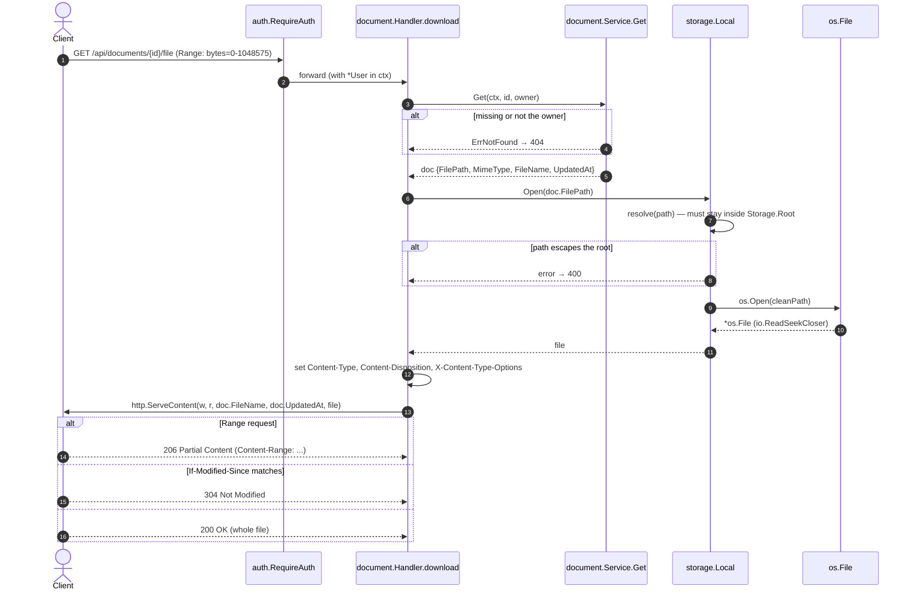

[← Back to the flow index](../FLOW.md)

# Flow: Download the file (`GET /api/documents/{id}/file`)

Streams the stored bytes back. Uses `http.ServeContent`, so it supports `Range`
requests (seeking in a PDF, resuming a download) for free.

---

## 1. Contract

- **Method & path**: `GET /api/documents/{id}/file`
- **Auth**: required (`godocs_session` cookie)
- **Request headers understood**: `Range`, `If-Modified-Since` (both handled by `http.ServeContent`)
- **Response headers set**:
  - `Content-Type` — the document's stored MIME type
  - `Content-Disposition: attachment; filename*=UTF-8''<encoded>` (RFC 5987)
  - `X-Content-Type-Options: nosniff`
  - `Accept-Ranges: bytes` (added by `ServeContent`)

---

## 2. Sequence

---

## 3. Step by step

1. **Look up the document** with the same owner-scoped `Get` the other endpoints
   use — someone else's id is a `404`.
2. **Path-traversal check.** A `FilePath` comes from the database, but the code
   still doesn't trust it. `storage.Local.resolve` joins it onto the storage root,
   `filepath.Clean`s the result, and verifies it's still under the root
   directory. So even a tampered row can't read `../../etc/passwd`.
3. **Open the file.** `*os.File` satisfies `io.ReadSeekCloser`, which is exactly
   what `http.ServeContent` needs to seek.
4. **RFC 5987 filename.** `Content-Disposition` uses `filename*=UTF-8''...` with
   every non-alphanumeric byte percent-encoded. That allows non-ASCII names and
   removes any chance of newline/quote injection into the header.
5. **`nosniff`.** Tells the browser not to second-guess the `Content-Type`, so an
   uploaded file can't be re-interpreted as HTML/JS and run.
6. **`ServeContent` does the rest** — it parses `Range`, sends `206` with a
   `Content-Range`, handles `If-Modified-Since` → `304`, and otherwise streams
   the whole file with `200`.
