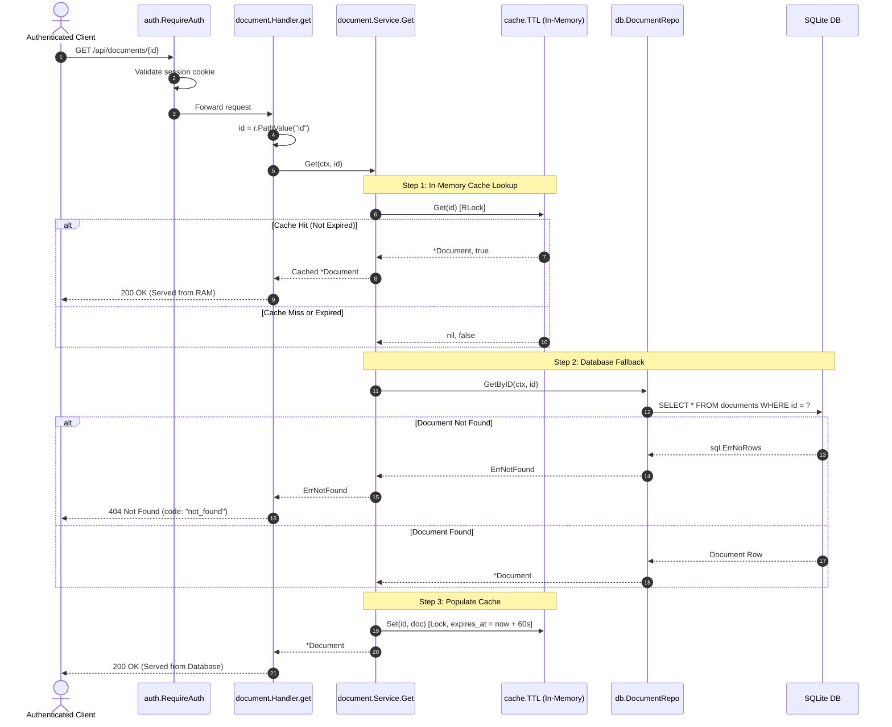

[← Back to Master Flow Catalog](../FLOW.md)

# Flow: Get Document Details (`GET /api/documents/{id}`)

This document explains the document retrieval flow in **`godocs`**, showcasing the Cache-Aside pattern and thread-safe in-memory caching.

---

## 1. Overview & Endpoint Contract

- **HTTP Method & Path**: `GET /api/documents/{id}`
- **Authentication Required**: Yes (`session_id` cookie via `auth.RequireAuth`)
- **Caching Mechanism**: Thread-safe in-memory generic cache (`cache.TTL[string, *Document]`, default TTL: 60s)
- **Response Content-Type**: `application/json`

### Request Example
```http
GET /api/documents/0191c49b-89ef-73a2-97b1-b92e316a1b22 HTTP/1.1
Cookie: session_id=0191c49b-73a2-71c1-90a8-a5b8b6e680a1
```

### Response Payload (`200 OK`)
```json
{
  "id": "0191c49b-89ef-73a2-97b1-b92e316a1b22",
  "title": "Quarterly Financial Report",
  "summary": "Q3 balance sheets and cash flow projections",
  "file_name": "q3_report.pdf",
  "file_size": 2048576,
  "mime_type": "application/pdf",
  "checksum": "e3b0c44298fc1c149afbf4c8996fb92427ae41e4649b934ca495991b7852b855",
  "status": "ready",
  "created_by": "0191c49b-73a2-71c1-90a8-a5b8b6e680a1",
  "created_at": "2026-09-10T10:15:00Z",
  "updated_at": "2026-09-10T10:15:30Z"
}
```

---

## 2. Sequence Diagram



---

## 3. Step-by-Step Processing Pipeline

1. **Path Parameter Resolution**:
   Go 1.22+ standard routing extracts the `{id}` wildcard via `r.PathValue("id")`.
2. **Cache Read (`RLock`)**:
   Queries `cache.Cache.Get(id)`. Multiple concurrent readers can query simultaneously without contention.
3. **Database Read**:
   If the key does not exist or has expired, queries the SQLite `documents` table by primary key.
4. **Cache Backfill (`Lock`)**:
   Populates the cache entry with an expiration timestamp (`time.Now().Add(cfg.CacheTTL)`).
5. **JSON Serialization**:
   Emits the full document metadata object.
