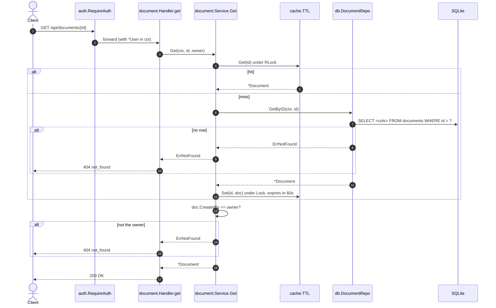

[← Back to the flow index](../FLOW.md)

# Flow: Get one document (`GET /api/documents/{id}`)

Returns a single document's metadata. Shows the **cache-aside** pattern: check an
in-memory cache first, fall back to the database, then fill the cache.

---

## 1. Contract

- **Method & path**: `GET /api/documents/{id}`
- **Auth**: required (`godocs_session` cookie)
- **Cache**: `cache.TTL[string, *Document]`, entries live `APP_CACHE_TTL_SEC` (default 60s)
- **Response**: JSON (same shape as one item from the list endpoint)

```http
GET /api/documents/9f1c0b7a5e2d4c8b6a3f1e0d9c8b7a6f HTTP/1.1
Cookie: godocs_session=<token>
```

```json
{
  "id": "9f1c0b7a5e2d4c8b6a3f1e0d9c8b7a6f",
  "title": "Quarterly Report",
  "summary": "Q3 numbers",
  "file_name": "q3_report.pdf",
  "size_bytes": 2048576,
  "mime_type": "application/pdf",
  "checksum": "e3b0c44298fc1c149afbf4c8996fb92427ae41e4649b934ca495991b7852b855",
  "status": "ready",
  "created_by": "3f9a2b7c1d8e4f0a6b5c9d2e7f1a0b3c",
  "created_at": "2026-09-10T10:15:00Z",
  "updated_at": "2026-09-10T10:15:30Z"
}
```

---

## 2. Sequence



---

## 3. Step by step

1. **Path value.** Go 1.22 routing gives you `r.PathValue("id")` for the `{id}`
   segment in the pattern `GET /api/documents/{id}`.
2. **Cache first.** `cache.TTL.Get` takes a read lock (`RLock`), so many
   `GET`s run in parallel. A hit returns the pointer straight away.
3. **Database on a miss.** `GetByID` maps `sql.ErrNoRows` to the domain's
   `ErrNotFound`, which the handler renders as `404`.
4. **Fill the cache** under a write lock, with an expiry of `now + TTL`.
5. **Ownership check comes last**, after the document is in hand (from cache or
   DB). If `created_by` isn't the caller, return `ErrNotFound` — same `404` as a
   missing document, so you can't probe for ids that exist.

> The cache is keyed by id only, and a document has exactly one owner, so a
> cached entry can't leak to another user — the ownership check still runs on
> every request, hit or miss.
