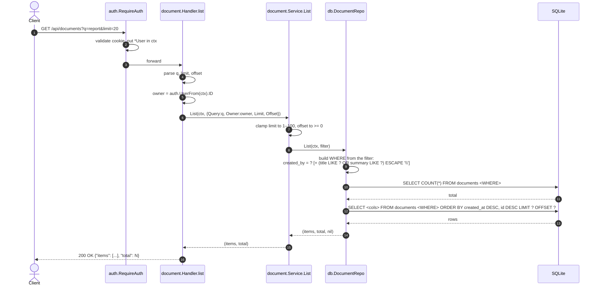

[← Back to the flow index](../FLOW.md)

# Flow: List / search documents (`GET /api/documents`)

Returns a page of the caller's documents, newest first, with an optional text
search over `title` and `summary`.

---

## 1. Contract

- **Method & path**: `GET /api/documents`
- **Auth**: required (`godocs_session` cookie)
- **Query params**:
  - `q` — optional search term (matched against `title` and `summary`)
  - `limit` — page size, default 20, clamped to 1–100
  - `offset` — how many rows to skip, default 0
- **Response**: JSON

```http
GET /api/documents?q=report&limit=10&offset=0 HTTP/1.1
Cookie: godocs_session=<token>
```

```json
{
  "items": [
    {
      "id": "9f1c0b7a5e2d4c8b6a3f1e0d9c8b7a6f",
      "title": "Quarterly Report",
      "summary": "Q3 numbers",
      "file_name": "q3_report.pdf",
      "size_bytes": 2048576,
      "mime_type": "application/pdf",
      "checksum": "e3b0c44298fc1c149afbf4c8996fb92427ae41e4649b934ca495991b7852b855",
      "status": "ready",
      "created_by": "3f9a2b7c1d8e4f0a6b5c9d2e7f1a0b3c",
      "created_at": "2026-09-10T10:15:00Z",
      "updated_at": "2026-09-10T10:15:30Z"
    }
  ],
  "total": 1
}
```

`total` is the count of *matching* rows (ignoring `limit`/`offset`), so the
frontend can render pagination.

---

## 2. Sequence



---

## 3. Step by step

1. **Clamp the paging params.** `limit <= 0` or `> 100` becomes 20; negative
   `offset` becomes 0. Bad input can't ask for a huge page.
2. **Scope to the owner.** The handler passes the caller's id as `Owner`, and the
   repo adds `created_by = ?` to every query. You only ever see your own
   documents; there is no way to page through someone else's.
3. **Escape `LIKE` wildcards.** In SQL `LIKE`, `%` and `_` are wildcards. If a
   user searches for `50%`, you don't want it to match everything. The repo runs
   the term through:

   ```go
   strings.NewReplacer(`\`, `\\`, `%`, `\%`, `_`, `\_`).Replace(term)
   ```

   and the query uses `LIKE ? ESCAPE '\'`, so those characters match literally.
4. **Count, then fetch.** One `SELECT COUNT(*)` with the same `WHERE` for
   `total`, then the page itself, ordered `created_at DESC, id DESC`. The `id`
   part matters: `created_at` is stored to the second, so many rows can share a
   value; without a unique tie-breaker, two `OFFSET` pages could order the ties
   differently and the client would see a row twice (or miss one).
5. **Close the rows.** The repo `defer rows.Close()` and checks `rows.Err()`
   after the loop — skipping either is a classic `database/sql` bug that leaks
   connections or hides errors.
