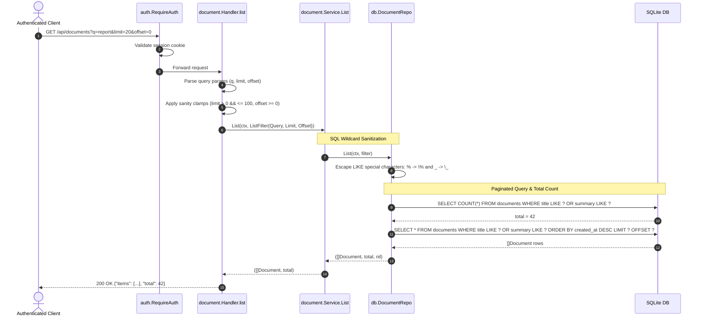

[← Back to Master Flow Catalog](../FLOW.md)

# Flow: Document Listing & Search (`GET /api/documents`)

This document details the paginated query and search flow for documents in **`godocs`**.

---

## 1. Overview & Endpoint Contract

- **HTTP Method & Path**: `GET /api/documents`
- **Authentication Required**: Yes (`session_id` cookie via `auth.RequireAuth`)
- **Query Parameters**:
  - `q` (string, optional): Search query matching `title` or `summary`.
  - `limit` (integer, optional): Number of records per page (default: 20, max: 100).
  - `offset` (integer, optional): Pagination offset (default: 0).
- **Response Content-Type**: `application/json`

### Request Example
```http
GET /api/documents?q=financial&limit=10&offset=0 HTTP/1.1
Cookie: session_id=0191c49b-73a2-71c1-90a8-a5b8b6e680a1
```

### Response Payload (`200 OK`)
```json
{
  "items": [
    {
      "id": "0191c49b-89ef-73a2-97b1-b92e316a1b22",
      "title": "Quarterly Financial Report",
      "summary": "Q3 balance sheets and cash flow projections",
      "file_name": "q3_report.pdf",
      "file_size": 2048576,
      "mime_type": "application/pdf",
      "checksum": "e3b0c44298fc1c149afbf4c8996fb92427ae41e4649b934ca495991b7852b855",
      "status": "ready",
      "created_by": "0191c49b-73a2-71c1-90a8-a5b8b6e680a1",
      "created_at": "2026-09-10T10:15:00Z",
      "updated_at": "2026-09-10T10:15:30Z"
    }
  ],
  "total": 1
}
```

---

## 2. Sequence Diagram



---

## 3. Step-by-Step Processing Pipeline

1. **Parameter Sanitization & Defaults**:
   - `limit`: If $\le 0$, defaults to `20`. If $> 100$, clamped to `100`.
   - `offset`: If $< 0$, defaults to `0`.
2. **LIKE Wildcard Escaping**:
   User input strings can inadvertently contain SQL wildcard symbols `%` and `_`. [`internal/db/repo.go`](file:///home/vnjdev/projects/godocs/internal/db/repo.go) escapes them:
   ```go
   escaped := strings.ReplaceAll(q, `\`, `\\`)
   escaped = strings.ReplaceAll(escaped, `%`, `\%`)
   escaped = strings.ReplaceAll(escaped, `_`, `\_`)
   pattern := "%" + escaped + "%"
   ```
   This guarantees users search for literal `%` or `_` characters without altering the query grammar.
3. **Total Count Evaluation**:
   Executes `SELECT COUNT(*)` with the active filter to provide accurate total item counts for pagination controls.
4. **Data Retrieval**:
   Returns the slice of documents ordered chronologically (`created_at DESC`).
