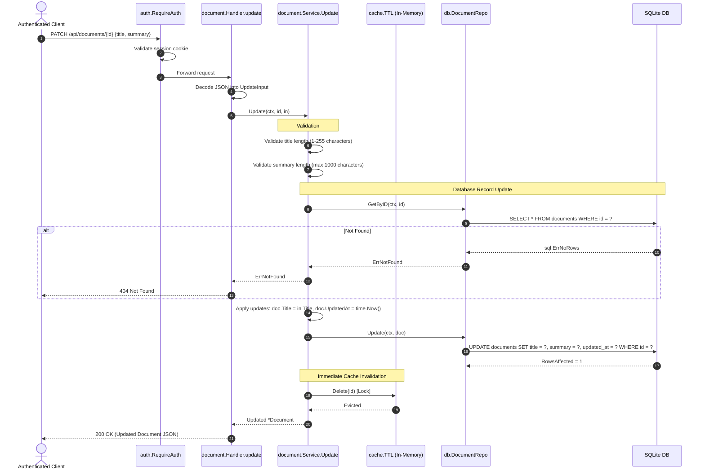

[← Back to Master Flow Catalog](../FLOW.md)

# Flow: Update Document Metadata (`PATCH /api/documents/{id}`)

This document details the metadata modification flow in **`godocs`**, emphasizing validation and immediate cache invalidation.

---

## 1. Overview & Endpoint Contract

- **HTTP Method & Path**: `PATCH /api/documents/{id}`
- **Authentication Required**: Yes (`session_id` cookie via `auth.RequireAuth`)
- **Request Content-Type**: `application/json`
- **Cache Effect**: Invalidates (`cache.Delete`) the corresponding cached document entry.

### Request Payload
```json
{
  "title": "Updated Financial Analysis Q3",
  "summary": "Revised revenue numbers following audited statement"
}
```

### Response Payload (`200 OK`)
```json
{
  "id": "0191c49b-89ef-73a2-97b1-b92e316a1b22",
  "title": "Updated Financial Analysis Q3",
  "summary": "Revised revenue numbers following audited statement",
  "file_name": "q3_report.pdf",
  "file_size": 2048576,
  "mime_type": "application/pdf",
  "checksum": "e3b0c44298fc1c149afbf4c8996fb92427ae41e4649b934ca495991b7852b855",
  "status": "ready",
  "created_by": "0191c49b-73a2-71c1-90a8-a5b8b6e680a1",
  "created_at": "2026-09-10T10:15:00Z",
  "updated_at": "2026-09-10T10:30:00Z"
}
```

---

## 2. Sequence Diagram



---

## 3. Step-by-Step Processing Pipeline

1. **JSON Payload Decoding**:
   Deserializes the partial update fields with strict validation checks.
2. **Entity Existence Check**:
   Fetches the active database record. If missing, returns `404 Not Found`.
3. **Selective Mutation**:
   Updates only provided fields (`title`, `summary`) and bumps `updated_at` to the current timestamp.
4. **Database Commitment**:
   Commits the changes to SQLite.
5. **Immediate Cache Eviction**:
   Calls `cache.Delete(id)` under an exclusive write lock. Subsequent read calls (`GET /api/documents/{id}`) will experience a cache miss and reload the freshly updated data from SQLite into RAM.
