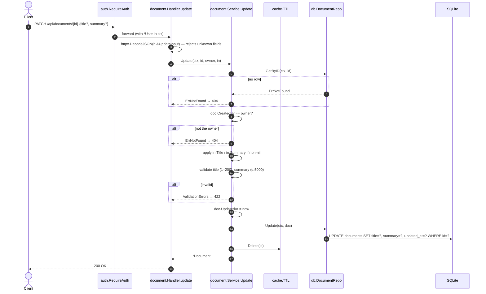

[← Back to the flow index](../FLOW.md)

# Flow: Update metadata (`PATCH /api/documents/{id}`)

Changes `title` and/or `summary` on a document you own. Only the fields you send
are touched. After the write, the cache entry is dropped.

---

## 1. Contract

- **Method & path**: `PATCH /api/documents/{id}`
- **Auth**: required (`godocs_session` cookie)
- **Body**: JSON with any of `title`, `summary`
- **Cache**: deletes the entry for this id

### Request

```json
{ "title": "Updated Q3 Report" }
```

### Response — `200 OK`

```json
{
  "id": "9f1c0b7a5e2d4c8b6a3f1e0d9c8b7a6f",
  "title": "Updated Q3 Report",
  "summary": "Q3 numbers",
  "file_name": "q3_report.pdf",
  "size_bytes": 2048576,
  "mime_type": "application/pdf",
  "checksum": "e3b0c44298fc1c149afbf4c8996fb92427ae41e4649b934ca495991b7852b855",
  "status": "ready",
  "created_by": "3f9a2b7c1d8e4f0a6b5c9d2e7f1a0b3c",
  "created_at": "2026-09-10T10:15:00Z",
  "updated_at": "2026-09-10T10:30:00Z"
}
```

`UpdateInput` uses `*string` fields so the code can tell "not sent" (`nil`) from
"sent as empty string".

---

## 2. Sequence



---

## 3. Step by step

1. **Decode strictly.** `DecodeJSON` rejects unknown fields, so `{"titel": ...}`
   is a `400`, not a silent no-op.
2. **Load and check ownership.** Fetch the row; if it's missing or not yours,
   return `404`.
3. **Apply only what was sent.** `in.Title != nil` → set it (trimmed); same for
   `summary`. Then validate: `title` 1–200 runes, `summary` up to 5000.
4. **Write metadata only.** The `UPDATE` sets `title`, `summary`, `updated_at` —
   **not `status`**. The `status` column is written on a separate path
   (`SetStatus`, used by the worker). Keeping them apart means a `PATCH` of the
   title and a worker marking the document `ready` at the same moment can't
   overwrite each other.
5. **Invalidate, don't re-set, the cache.** `cache.Delete(id)`. The next `GET`
   misses and reloads fresh data. Writing the new value into the cache here would
   risk storing a row that a concurrent write just changed.
