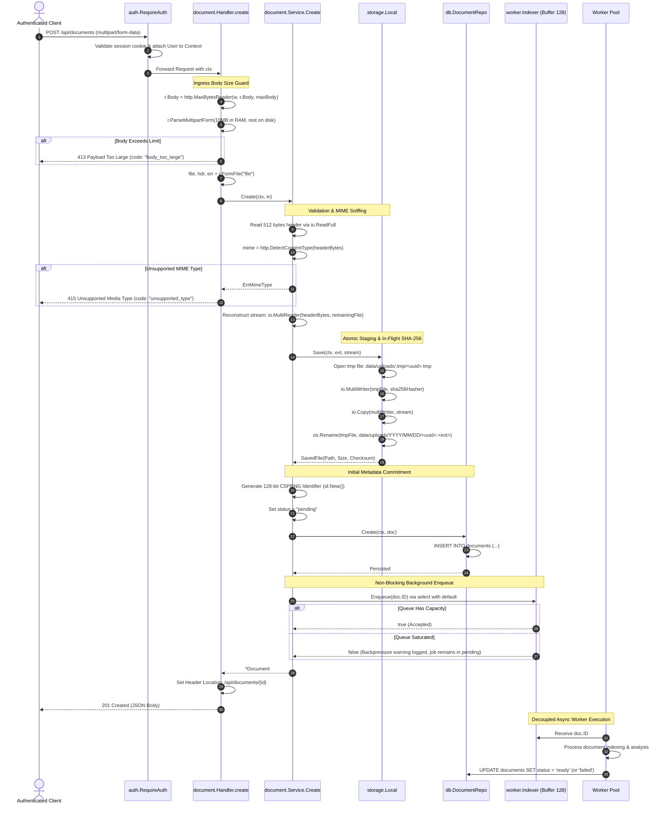

[← Back to Master Flow Catalog](../FLOW.md)

# Flow: Document Upload & Async Ingestion (`POST /api/documents`)

This document details the multi-stage execution pipeline for uploading a binary document, performing content-type verification, executing atomic disk persistence with in-flight hashing, persisting database metadata, and dispatching to background workers in **`godocs`**.

---

## 1. Overview & Endpoint Contract

- **HTTP Method & Path**: `POST /api/documents`
- **Authentication Required**: Yes (`session_id` cookie via `auth.RequireAuth`)
- **Request Content-Type**: `multipart/form-data`
- **Max Upload Limit**: Default 25MB (`APP_MAX_UPLOAD_MB=25`, enforced by `http.MaxBytesReader`)
- **Allowed MIME Types**: `application/pdf`, `image/png`, `image/jpeg`, `text/plain`

### Multipart Form Fields
| Field Name | Type | Required | Description |
|---|:---:|:---:|---|
| `file` | Binary File | Yes | Document file stream |
| `title` | String | No | Custom title (defaults to original filename if empty) |
| `summary` | String | No | Initial summary or description notes |

### Response Headers & Body (`201 Created`)
```http
HTTP/1.1 201 Created
Location: /api/documents/0191c49b-89ef-73a2-97b1-b92e316a1b22
Content-Type: application/json

{
  "id": "0191c49b-89ef-73a2-97b1-b92e316a1b22",
  "title": "Quarterly Financial Report",
  "summary": "Q3 balance sheets and cash flow projections",
  "file_name": "q3_report.pdf",
  "file_size": 2048576,
  "mime_type": "application/pdf",
  "checksum": "e3b0c44298fc1c149afbf4c8996fb92427ae41e4649b934ca495991b7852b855",
  "status": "pending",
  "created_by": "0191c49b-73a2-71c1-90a8-a5b8b6e680a1",
  "created_at": "2026-09-10T10:15:00Z",
  "updated_at": "2026-09-10T10:15:00Z"
}
```

---

## 2. Sequence Diagram



---

## 3. Step-by-Step Processing Pipeline

1. **Session Context Propagation**:
   The `RequireAuth` middleware verifies the session cookie, extracts the caller's `User` record, and attaches it to `r.Context()`. The handler retrieves `u.ID` to set `CreatedBy`.
2. **Payload Protection (`http.MaxBytesReader`)**:
   Enforces a strict cap on incoming bytes. If a client attempts to stream more than `APP_MAX_UPLOAD_MB`, reading is halted immediately and yields `413 Payload Too Large`.
3. **MIME Sniffing vs Extension Trust**:
   To prevent extension spoofing (e.g. uploading an executable renamed as `.pdf`), the service reads the first 512 bytes into memory and evaluates the magic bytes via `http.DetectContentType`. It accepts only:
   - `application/pdf`
   - `image/png`
   - `image/jpeg`
   - `text/plain`
   The original stream is seamlessly reconstructed with `io.MultiReader(bytes.NewReader(buf), io.LimitReader(file, remain))`, reading 1 byte beyond the ceiling to reliably catch overflows rather than silently truncating.
4. **Atomic Disk Persistence & Orphan Cleanup**:
   - Files are written to a temporary staging file (`data/uploads/.tmp/<id>.tmp`).
   - `io.MultiWriter` calculates the SHA-256 checksum in-flight as bytes are streamed to disk.
   - Upon successful synchronization, `os.Rename` moves the file into a date-partitioned directory tree (`data/uploads/YYYY/MM/DD/<id><ext>`).
   - If payload size exceeds ceiling mid-write, the orphaned file is purged via `blob.Delete(context.WithoutCancel(ctx), path)`, ensuring cleanup succeeds even if client context has been cancelled.
   - This ensures zero corrupted or partial files during power loss or server crashes.
5. **Database Insertion (`status = pending`)**:
   Generates a 128-bit CSPRNG hex identifier (`id.New()`) and commits metadata into SQLite with initial status `pending`.
6. **Non-Blocking Channel Enqueue**:
   The document ID is submitted to `worker.Indexer.Enqueue(id)`. If the 128-capacity buffer is saturated, it immediately returns `false` (backpressure) rather than blocking the client.
7. **Immediate 201 Created Response**:
   The client receives the metadata response right away without waiting for indexing to complete.
