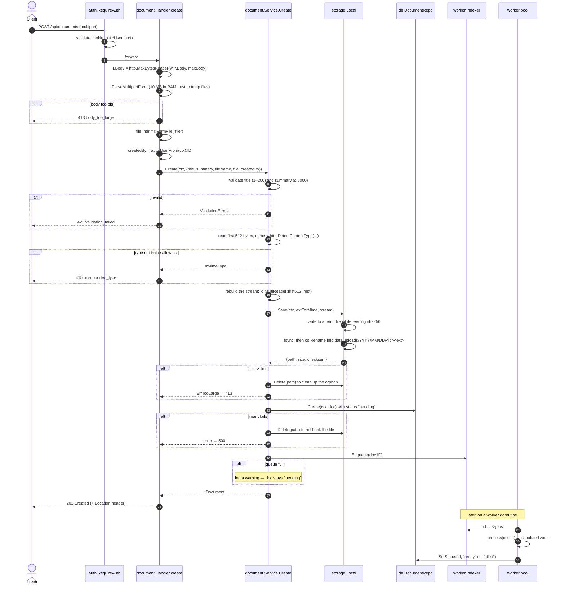

[← Back to the flow index](../FLOW.md)

# Flow: Upload a document (`POST /api/documents`)

Takes a multipart upload, checks its size and type, writes the bytes to disk
atomically while hashing them, saves a metadata row, and hands the id to a
background worker. The client gets `201` immediately — indexing happens after.

This flow touches most of the codebase, so it's a good one to trace end to end.

---

## 1. Contract

- **Method & path**: `POST /api/documents`
- **Auth**: required (`godocs_session` cookie → `auth.RequireAuth`)
- **Body**: `multipart/form-data`
- **Max size**: `APP_MAX_UPLOAD_MB` (default 25), enforced by `http.MaxBytesReader`
- **Accepted types** (decided by sniffing the bytes, not the filename):
  `application/pdf`, `image/png`, `image/jpeg`, `text/plain`

### Form fields

| Field | Required | Notes |
|---|:---:|---|
| `file` | yes | the file bytes |
| `title` | yes | 1–200 characters after trimming |
| `summary` | no | up to 5000 characters |

### Response — `201 Created`

```http
HTTP/1.1 201 Created
Location: /api/documents/9f1c0b7a5e2d4c8b6a3f1e0d9c8b7a6f
Content-Type: application/json

{
  "id": "9f1c0b7a5e2d4c8b6a3f1e0d9c8b7a6f",
  "title": "Quarterly Report",
  "summary": "Q3 numbers",
  "file_name": "q3_report.pdf",
  "size_bytes": 2048576,
  "mime_type": "application/pdf",
  "checksum": "e3b0c44298fc1c149afbf4c8996fb92427ae41e4649b934ca495991b7852b855",
  "status": "pending",
  "created_by": "3f9a2b7c1d8e4f0a6b5c9d2e7f1a0b3c",
  "created_at": "2026-09-10T10:15:00Z",
  "updated_at": "2026-09-10T10:15:00Z"
}
```

`created_by` is the caller's user id. `status` starts as `pending` and a worker
flips it to `ready` (or `failed`) a moment later. The internal disk path is not
in the response — its struct field is tagged `json:"-"`.

---

## 2. Sequence



---

## 3. Step by step

1. **Auth.** `RequireAuth` validates the session and puts the `*User` in the
   context; the handler reads `u.ID` for `created_by`.
2. **Size guard.** `http.MaxBytesReader` wraps the body first, so a client that
   keeps sending past `APP_MAX_UPLOAD_MB` is cut off and gets `413` — the server
   never buffers the whole thing.
3. **Type by content, not by name.** The service reads the first 512 bytes and
   calls `http.DetectContentType` (this is how `Content-Type` sniffing works in
   the standard library). Only the four allowed types pass. Then it stitches the
   stream back together with `io.MultiReader(bytes.NewReader(first512),
   io.LimitReader(file, remaining))` so no bytes are lost. The `LimitReader`
   allows one byte past the max so an over-size file is caught, not silently cut.
4. **The stored extension comes from the sniffed type** (`.pdf`, `.png`, `.jpg`,
   `.txt`) — never from the uploaded filename. A file called `invoice.php` full
   of PDF bytes is stored as `<id>.pdf`, so a bad name can't land an executable
   extension on disk.
5. **Atomic write.** `storage.Local.Save` writes to a temp file, hashes the bytes
   in the same pass with `io.MultiWriter(tmp, sha256)`, `fsync`s, then
   `os.Rename`s into a `YYYY/MM/DD` folder. `rename` on the same filesystem is
   atomic, so a crash mid-write leaves a stray `.part` file, never a half-written
   document.
6. **Compensating cleanup.** If the size check or the database insert fails after
   the file is on disk, the service deletes the file with
   `context.WithoutCancel(ctx)` so cleanup still runs even though the request
   context is done.
7. **Insert** the row with `status = "pending"`.
8. **Enqueue, without blocking.** `Indexer.Enqueue` does `select { case jobs <-
   id: return true; default: return false }`. The buffer holds `APP_QUEUE_SIZE`
   ids (default 128). If it's full, the upload still succeeds — the document just
   stays `pending`. `Service.RequeuePending`, called once at startup, re-enqueues
   anything still `pending`, so a dropped job (full queue, or a crash before the
   worker ran) is picked up on the next boot.
9. **Respond now.** `201` with a `Location` header. The client polls
   `GET /api/documents/{id}` to see `status` become `ready`.

---

## 4. Errors

| Condition | Status | Code |
|---|:---:|---|
| Not signed in | `401` | `unauthorized` |
| Body over the size limit | `413` | `body_too_large` |
| Malformed multipart body | `400` | `invalid_form` |
| No `file` part | `400` | `invalid_input` |
| `title` missing / too long, `summary` too long | `422` | `validation_failed` |
| Sniffed type not allowed | `415` | `unsupported_type` |
| File exceeds the limit (caught after write) | `413` | `file_too_large` |
| Database failure | `500` | `internal_error` |
