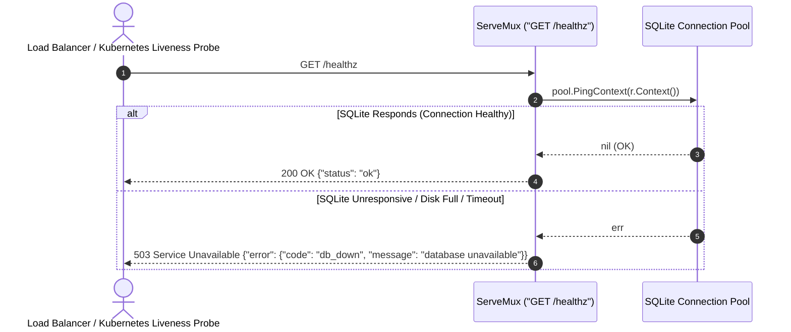

[← Back to Master Flow Catalog](../FLOW.md)

# Flow: System Health Check (`GET /healthz`)

This document describes the liveness and database connectivity probe flow in **`godocs`**.

---

## 1. Overview & Endpoint Contract

- **HTTP Method & Path**: `GET /healthz`
- **Authentication Required**: No (Public Liveness / Readiness Probe)
- **Rate Limit**: Subject to global IP rate limiting (`APP_RATE_RPS=10`, `APP_RATE_BURST=20`)
- **Response Content-Type**: `application/json`

### Success Response (`200 OK`)
```json
{
  "status": "ok"
}
```

### Unhealthy Response (`503 Service Unavailable`)
```json
{
  "error": {
    "code": "db_down",
    "message": "database unavailable"
  }
}
```

---

## 2. Sequence Diagram



---

## 3. Step-by-Step Processing Pipeline

1. **Context-Aware Database Ping**:
   Executes `pool.PingContext(r.Context())` against the SQLite driver. This checks:
   - SQLite file accessibility on disk.
   - Connection pool responsiveness within the request context deadline (30s).
   - Write-Ahead Logging (WAL) lock state.
2. **Kubernetes / Container Compatibility**:
   Returning `503 Service Unavailable` signals container orchestrators to remove the instance from service routing until health is restored.
