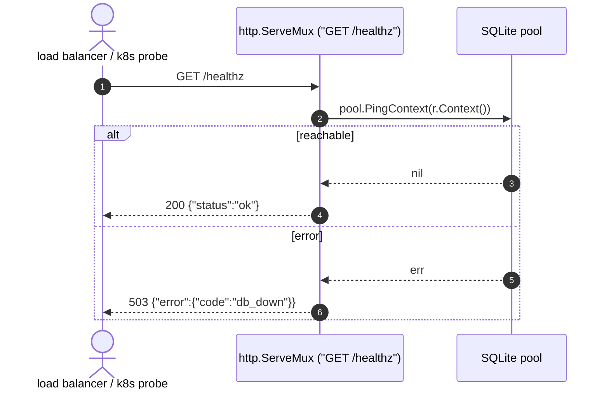

[← Back to the flow index](../FLOW.md)

# Flow: Health check (`GET /healthz`)

A liveness/readiness probe: is the process up *and* can it reach the database?

---

## 1. Contract

- **Method & path**: `GET /healthz`
- **Auth**: none
- **Rate limit**: the global per-IP limiter only (`APP_RATE_RPS`, `APP_RATE_BURST`)
- **Response**: JSON

`200 OK`

```json
{ "status": "ok" }
```

`503 Service Unavailable`

```json
{ "error": { "code": "db_down", "message": "database unavailable" } }
```

---

## 2. Sequence



---

## 3. Notes

1. **`PingContext`** opens (or reuses) a connection and runs SQLite's ping. It
   fails if the database file is unreachable or if the request's 30s context
   deadline is hit first.
2. **`503` is deliberate.** Orchestrators (Kubernetes, load balancers) read a
   `503` as "take this instance out of rotation until it recovers", which is what
   you want when the database is down.
3. The handler is registered directly on the mux, so it still passes through the
   full middleware chain (CORS, request id, logging, recover, rate limit,
   timeout).
